# Mooncake 技术文档

## 1. 项目概况

Mooncake 是一个面向 LLM 推理的 **KVCache 中心化解耦架构**，荣获 FAST 2025 最佳论文奖。该项目是 Moonshot AI 旗下 Kimi 产品的底层服务平台。

### 1.1 核心思想

传统 LLM 推理将 prefill（预填充）和 decoding（解码）耦合在同一组 GPU 上，导致资源利用率低。Mooncake 将二者解耦：

- **Prefill 集群**：负责处理长上下文的 KVCache 生成，计算密集
- **Decoding 集群**：负责逐 token 生成，显存密集
- **KVCache 池**：利用集群中闲置的 CPU、DRAM、SSD 资源，作为 prefill 和 decoding 之间的共享缓存层

### 1.2 核心组件

| 组件 | 目录 | 功能 |
|------|------|------|
| Transfer Engine (TE) | `mooncake-transfer-engine/` | 核心数据传输引擎，统一的批量传输接口 |
| Mooncake Store | `mooncake-store/` | 分布式 KVCache 存储引擎，构建在 TE 之上 |
| P2P Store | `mooncake-p2p-store/` | 点对点临时对象共享（Go 实现） |
| Expert Parallelism (EP) | `mooncake-ep/` | MoE 模型的弹性专家并行 |
| Peer Group (PG) | `mooncake-pg/` | EP 的放置组通信支持 |
| Common | `mooncake-common/` | 共享 CMake 工具、etcd Go 封装、ASIO 实现 |
| Integration | `mooncake-integration/` | Python 绑定（pybind11） |
| Wheel | `mooncake-wheel/` | Python wheel 打包 |

### 1.3 组件依赖关系

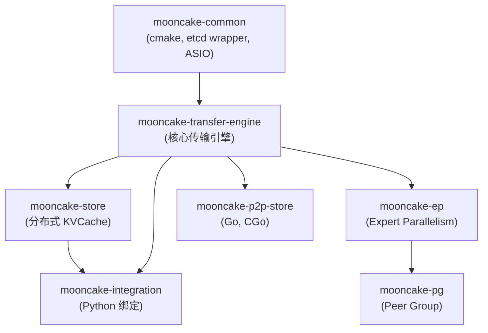

---

## 2. 功能总览

### 2.1 Transfer Engine 功能

- 统一的批量数据传输接口，支持 READ/WRITE 语义
- 多传输协议：RDMA、TCP、CXL、NVLink、EFA、HIP、NVMe-oF、Ascend、Barex、UB 等
- NUMA 感知的拓扑发现和设备选择
- 多元数据后端：etcd、Redis、HTTP
- P2P 直连模式（无需中心化元数据服务器）
- 通知机制（Notify）：传输完成后主动通知对端
- 事件驱动完成模式（Event-Driven Completion）
- 多协议支持（Multi-Protocol）：同一内存可注册到多个传输协议
- TENT：下一代传输引擎，支持跨协议 staging 和故障转移

### 2.2 Mooncake Store 功能

- 分布式 KVCache 存储，多副本支持
- 分条（Striping）和并行 I/O
- 内存、磁盘、本地磁盘三级存储
- 高可用（HA）：热备、oplog 复制、快照
- HA 后端：etcd、Redis、K8s Lease
- 集成 vLLM、SGLang HiCache、LMCache
- Python/C++/Rust/Go 多语言绑定

### 2.3 框架集成

- vLLM：PD 解耦后端
- SGLang：HiCache 层级缓存
- LMDeploy、TensorRT-LLM、vLLM-Ascend

---

## 3. Transfer Engine 详尽文档

### 3.1 整体架构

Transfer Engine 采用分层架构：

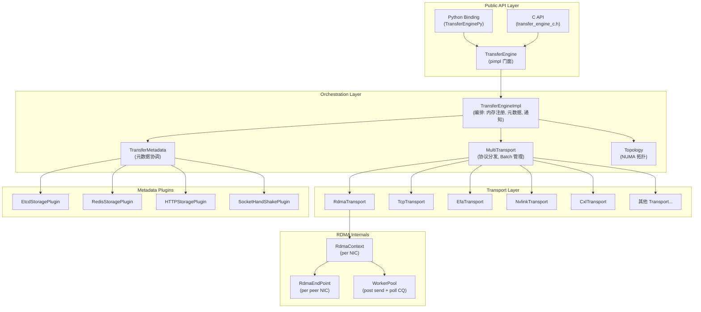

### 3.2 核心类详解

#### 3.2.1 TransferEngine — 顶层 API

**文件**: `mooncake-transfer-engine/include/transfer_engine.h`

TransferEngine 是面向用户的顶层类，采用 pimpl 模式，内部委托给 `TransferEngineImpl`。当环境变量 `MC_USE_TENT` 或 `MC_USE_TEV1` 被设置时，委托给 TENT 实现。

**类型别名**:

```cpp
using TransferRequest  = Transport::TransferRequest;
using TransferStatus   = Transport::TransferStatus;
using TransferStatusEnum = Transport::TransferStatusEnum;
using SegmentHandle    = Transport::SegmentHandle;   // uint64_t
using SegmentID        = Transport::SegmentID;        // uint64_t
using BatchID          = Transport::BatchID;           // uint64_t
using BufferEntry      = Transport::BufferEntry;
const static BatchID INVALID_BATCH_ID = UINT64_MAX;
```

**核心 API 方法**:

| 方法 | 说明 |
|------|------|
| `init(metadata_conn_string, local_server_name, ip_or_host_name, rpc_port)` | 初始化引擎，连接元数据服务 |
| `installTransport(proto, args)` | 安装传输协议（"rdma", "tcp" 等） |
| `openSegment(segment_name)` → `SegmentHandle` | 打开远端段，返回段句柄 |
| `closeSegment(handle)` | 关闭段 |
| `registerLocalMemory(addr, length, location, remote_accessible, update_metadata)` | 注册本地内存区域 |
| `unregisterLocalMemory(addr, update_metadata)` | 注销本地内存 |
| `submitTransfer(batch_id, entries)` | 提交批量传输请求 |
| `submitTransferWithNotify(batch_id, entries, notify_msg)` | 提交传输并附带通知 |
| `getTransferStatus(batch_id, task_id, status)` | 查询单个任务传输状态 |
| `getBatchTransferStatus(batch_id, status)` | 查询整批传输状态 |
| `allocateBatchID(batch_size)` → `BatchID` | 分配批量 ID |
| `freeBatchID(batch_id)` | 释放批量 ID |
| `getNotifies(notifies)` | 获取对端通知 |
| `probePeerAliveByID(target_id)` → `PeerLiveness` | 探测对端存活状态 |

**PeerLiveness 枚举**:

```cpp
enum class PeerLiveness : uint8_t {
    Alive = 0,
    Unreachable = 1,
};
```

**元数据连接字符串格式**: `proto://address`
- `etcd://127.0.0.1:2379` — etcd 后端
- `redis://127.0.0.1:6379` — Redis 后端
- `http://127.0.0.1:8080` — HTTP 后端
- `P2PHANDSHAKE` — P2P 直连模式，无中心化元数据服务器

#### 3.2.2 TransferEngineImpl — 实现核心

**文件**: `mooncake-transfer-engine/include/transfer_engine_impl.h`, `src/transfer_engine_impl.cpp`

TransferEngineImpl 持有引擎的核心状态并编排所有操作。

**关键成员**:

```cpp
std::shared_ptr<TransferMetadata> metadata_;           // 元数据协调器
std::string local_server_name_;                         // 本地服务器名称
std::shared_ptr<MultiTransport> multi_transports_;      // 多传输协议管理器
std::shared_mutex mutex_;                               // 保护内存区域映射
MemoryRegionMap local_memory_regions_;                  // 已注册内存区域（按地址排序）
std::shared_ptr<Topology> local_topology_;              // NUMA 拓扑
RWSpinlock send_notifies_lock_;                         // 保护通知映射
std::unordered_map<BatchID, std::pair<SegmentID, NotifyDesc>> notifies_to_send_;  // 待发送通知
bool auto_discover_;                                    // 自动发现拓扑
```

**init() 流程**:

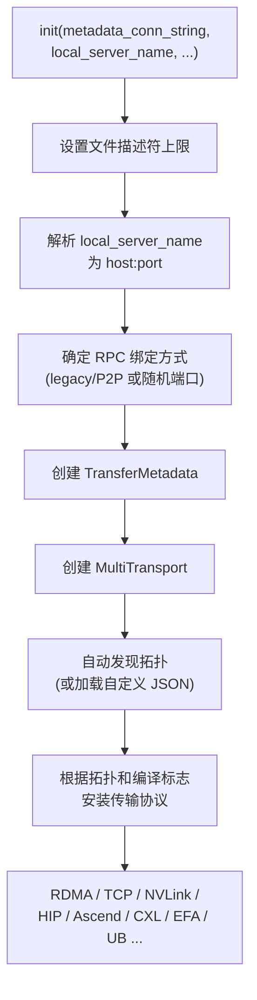

**内存注册** (`registerLocalMemory`):

1. 检查与已注册区域是否重叠（使用 `std::map` 的 `upper_bound`/`lower_bound`）
2. 向所有已安装的 Transport 注册内存
3. 记录到 `local_memory_regions_` 映射

**submitTransfer** 委托给 `multi_transports_->submitTransfer()`，在 `WITH_METRICS` 下记录 `task.start_time`。

**getTransferStatus** 在终端状态（COMPLETED/FAILED/CANCELED/TIMEOUT）下触发指标收集，并在 COMPLETED 时发送待发的通知。

#### 3.2.3 Transport — 传输协议抽象基类

**文件**: `mooncake-transfer-engine/include/transport/transport.h`

Transport 定义了所有传输协议必须实现的接口。

**TransferRequest 结构体**:

```cpp
struct TransferRequest {
    enum OpCode { READ, WRITE };
    OpCode opcode;
    void *source;            // 本地内存地址
    SegmentID target_id;     // 目标段 ID
    uint64_t target_offset;  // 目标偏移量
    size_t length;           // 传输长度
    int advise_retry_cnt = 0;
};
```

**TransferStatusEnum 枚举**:

```cpp
enum TransferStatusEnum {
    WAITING,    // 等待调度
    PENDING,    // 正在传输
    INVALID,    // 无效请求
    CANCELED,   // 已取消
    COMPLETED,  // 已完成
    TIMEOUT,    // 超时
    FAILED      // 失败
};
```

**Slice — 传输的基本工作单元**:

Slice 是 Transport 层处理的最小单位。每个 Slice 包含一个 tag union，用于存储协议特定的数据：

```cpp
struct Slice {
    // 公共字段
    void *source_addr;
    size_t length;
    TransferRequest::OpCode opcode;
    SegmentID target_id;
    std::string peer_nic_path;
    SliceStatus status;
    TransferTask *task;
    std::vector<uint32_t> dest_rkeys;

    // 协议特定数据（union）
    union {
        struct { uint64_t dest_addr; uint32_t source_lkey; uint32_t dest_rkey;
                 int lkey_index; int rkey_index; volatile int *qp_depth;
                 uint32_t retry_cnt; uint32_t max_retry_cnt; } rdma;
        struct { uint64_t dest_addr; volatile int *jetty_depth;
                 uint32_t retry_cnt; uint32_t max_retry_cnt;
                 void *r_seg; void *l_seg; } ub;
        struct { void *dest_addr; } local;
        struct { uint64_t dest_addr; } tcp;
        struct { uint64_t offset; int cufile_desc; uint64_t start; const char *file_path; } nvmeof;
        struct { void *dest_addr; } cxl;
        struct { uint64_t dest_addr; } hccl;
        struct { uint64_t dest_addr; void *handle; int64_t start_time; int32_t engine_id; } ascend_direct;
        struct { uint64_t dest_addr; } ubshmem;
    };

    void markSuccess();  // 原子更新 task->transferred_bytes 和 success_slice_count
    void markFailed();   // 原子更新 task->failed_slice_count
};
```

**TransferTask — 任务跟踪**:

```cpp
struct TransferTask {
    volatile uint64_t slice_count = 0;
    volatile uint64_t success_slice_count = 0;
    volatile uint64_t failed_slice_count = 0;
    volatile uint64_t transferred_bytes = 0;
    volatile bool is_finished = false;
    uint64_t total_bytes = 0;
    BatchID batch_id = 0;
    std::vector<Slice *> slice_list;
    // USE_EVENT_DRIVEN_COMPLETION: volatile uint64_t completed_slice_count
    // WITH_METRICS: std::chrono::steady_clock::time_point start_time
};
```

**BatchDesc — 批量描述符**:

```cpp
struct BatchDesc {
    BatchID id;
    size_t batch_size;
    std::vector<TransferTask> task_list;
    void *context;
    int64_t start_timestamp;
    std::atomic<bool> has_failure{false};
    std::atomic<bool> is_finished{false};
    std::atomic<uint64_t> finished_transfer_bytes{0};
    // USE_EVENT_DRIVEN_COMPLETION:
    //   std::atomic<uint64_t> finished_task_count{0};
    //   std::mutex completion_mutex;
    //   std::condition_variable completion_cv;
};
```

**BatchID 的零开销设计**: `BatchID` 是 `uint64_t`，实际上是 `BatchDesc*` 的 `reinterpret_cast`，避免了哈希查找。

**ThreadLocalSliceCache**: 每线程 Slice 对象缓存（4096 容量的环形缓冲区），避免频繁堆分配。

**Transport 纯虚接口**:

| 方法 | 说明 |
|------|------|
| `submitTransfer(batch_id, entries)` | 提交传输（纯虚） |
| `getTransferStatus(batch_id, task_id, status)` | 查询状态（纯虚） |
| `install(local_server_name, meta, topo)` | 初始化传输资源 |
| `registerLocalMemory(addr, length, location, ...)` | 注册内存（纯虚） |
| `unregisterLocalMemory(addr, ...)` | 注销内存（纯虚） |
| `getName()` | 返回协议名（纯虚） |

#### 3.2.4 MultiTransport — 协议分发器

**文件**: `mooncake-transfer-engine/include/multi_transport.h`, `src/multi_transport.cpp`

MultiTransport 持有多个命名 Transport 实例，根据目标段的协议选择合适的 Transport。

**关键成员**:

```cpp
std::shared_ptr<TransferMetadata> metadata_;
std::string local_server_name_;
std::map<std::string, std::shared_ptr<Transport>> transport_map_;  // 协议名 → Transport
RWSpinlock batch_desc_lock_;
std::unordered_map<BatchID, std::shared_ptr<BatchDesc>> batch_desc_set_;
```

**submitTransfer 流程**:

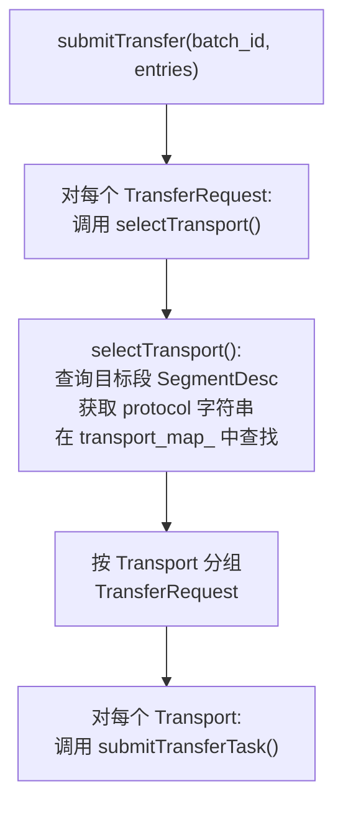

**installTransport 工厂方法**: 根据 protocol 名称创建对应的 Transport 实例，支持 "rdma", "tcp", "barex", "nvmeof", "ascend", "nvlink", "hip", "maca", "cxl", "efa", "ub", "ubshmem"。

#### 3.2.5 TransferMetadata — 元数据协调器

**文件**: `mooncake-transfer-engine/include/transfer_metadata.h`, `src/transfer_metadata.cpp`

TransferMetadata 是中心化的元数据协调器，管理段描述符、RPC 元数据、握手和通知。

**核心数据结构**:

```cpp
// 设备描述符（RDMA NIC）
struct DeviceDesc {
    std::string name;    // 设备名（如 "mlx5_0"）
    uint16_t lid;        // LID
    std::string gid;     // GID
    std::string eid;     // for UB
};

// 缓冲区描述符
struct BufferDesc {
    std::string name;
    uint64_t addr;                    // 虚拟地址
    uint64_t length;                  // 长度
    std::vector<uint32_t> lkey;       // 本地访问密钥（per NIC）
    std::vector<uint32_t> rkey;       // 远程访问密钥（per NIC）
    std::string shm_name;             // 共享内存名（NVLink/HIP）
    uint64_t offset;                  // CXL 偏移
    std::vector<std::string> tseg;    // UB/URMA 段
    std::vector<uint32_t> l_seg_index;// UB/URMA 段索引
};

// 段描述符
struct SegmentDesc {
    std::string name;                      // 段名称
    std::string protocol;                  // 协议（"rdma", "tcp", ...）
    std::vector<DeviceDesc> devices;       // RDMA 设备列表
    Topology topology;                     // 拓扑信息
    std::vector<BufferDesc> buffers;       // 注册的内存缓冲区
    std::vector<NVMeoFBufferDesc> nvmeof_buffers;
    std::string cxl_name;
    uint64_t cxl_base_addr;
    RankInfoDesc rank_info;                // Ascend 排信息
    int tcp_data_port;                     // TCP 数据端口
};

// 握手描述符
struct HandShakeDesc {
    std::string local_nic_path;            // 本地 NIC 路径（server@nic）
    uint16_t local_lid;
    std::string local_gid;
    std::string peer_nic_path;             // 对端 NIC 路径
    std::vector<uint32_t> qp_num;          // QP 号列表
    std::string reply_msg;                 // 错误信息
};

// RPC 元数据
struct RpcMetaDesc {
    std::string ip_or_host_name;
    uint16_t rpc_port;
    int sockfd;                            // 本地缓存
};
```

**元数据存储插件架构**:

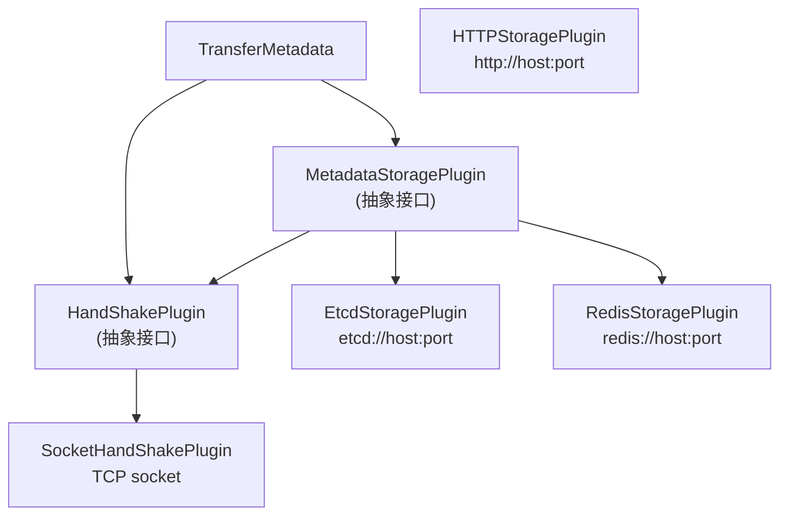

**段描述符缓存**: `getSegmentDescByName()` 使用读写锁保护的双检模式：先读锁检查缓存，未命中则从存储后端获取（网络 I/O），再写锁更新缓存。

**段描述符序列化**: `encodeSegmentDesc()` / `decodeSegmentDesc()` 将 SegmentDesc 序列化为 JSON，包含协议特定字段：
- RDMA: devices (lid, gid), buffers (lkey/rkey 数组), priority_matrix
- TCP: addr, length, tcp_data_port
- CXL: cxl_name, cxl_base_addr, offset
- NVLink/HIP/MACA: shm_name
- Ascend: rank_info
- 多协议: JSON 数组

#### 3.2.6 Topology — NUMA 拓扑发现

**文件**: `mooncake-transfer-engine/include/topology.h`, `src/topology.cpp`

Topology 发现并维护机器上 NUMA 到 NIC 的亲和性关系。

**TopologyEntry**:

```cpp
struct TopologyEntry {
    std::string name;                    // 存储类型（如 "cpu:0", "gpu:0"）
    std::vector<std::string> preferred_hca;  // 首选 HCA 列表
    std::vector<std::string> avail_hca;      // 可用 HCA 列表
};
using TopologyMatrix = std::unordered_map<std::string, TopologyEntry>;
```

**拓扑发现流程**:

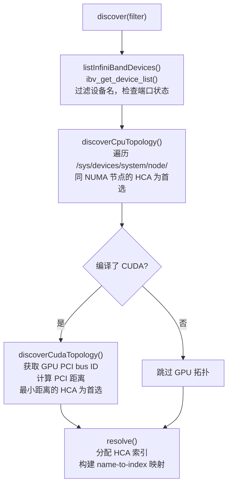

**selectDevice 策略**:
- `retry_count=0`: 从 preferred_hca 随机选择（或 `MC_PATH_ROUNDROBIN` 轮询），回退到 avail_hca
- `retry_count>0`: 确定性循环遍历 preferred+available，用于故障重试

**PCI 距离计算**: 通过比较 `/sys/bus/pci/devices/` 路径的目录深度差异来确定 GPU 和 HCA 的拓扑距离。

#### 3.2.7 GlobalConfig — 全局配置

**文件**: `mooncake-transfer-engine/include/config.h`, `src/config.cpp`

GlobalConfig 通过环境变量加载，单例模式访问（`globalConfig()`）。

**关键配置项**:

| 环境变量 | 配置字段 | 默认值 | 说明 |
|----------|----------|--------|------|
| `MC_NUM_CQ_PER_CTX` | num_cq_per_ctx | 1 | 每个 Context 的 CQ 数量 |
| `MC_IB_PORT` | port | 1 | IB 端口号 |
| `MC_GID_INDEX` | gid_index | -1（自动） | GID 索引 |
| `MC_MAX_CQE_PER_CTX` | max_cqe | 4096 | 每 CQ 最大完成条目 |
| `MC_MAX_EP_PER_CTX` | max_ep_per_ctx | 65536 | 每 Context 最大端点数 |
| `MC_NUM_QP_PER_EP` | num_qp_per_ep | 2 | 每端点 QP 数量 |
| `MC_MAX_SGE` | max_sge | 4 | 最大 SGE 数 |
| `MC_MAX_WR` | max_wr | 256 | 最大 WR 深度 |
| `MC_MAX_INLINE` | max_inline | 64 | 最大 inline 数据 |
| `MC_MTU` | mtu_length | 4096 | MTU 大小 |
| `MC_HANDSHAKE_PORT` | handshake_port | 12001 | 握手端口 |
| `MC_WORKERS_PER_CTX` | workers_per_ctx | 2 | 每 Context 工作线程数 |
| `MC_SLICE_SIZE` | slice_size | 65536 | Slice 大小 |
| `MC_RETRY_CNT` | retry_cnt | 9 | 重试次数 |
| `MC_LOG_LEVEL` | log_level | INFO | 日志级别 |
| `MC_ENDPOINT_STORE_TYPE` | endpoint_store_type | SIEVE | 端点存储类型（FIFO/SIEVE） |
| `MC_IB_TC` | ib_traffic_class | -1 | IB 流量类别 |
| `MC_IB_PCI_RELAXED_ORDERING` | ib_pci_relaxed_ordering_mode | 0 | PCI Relaxed Ordering |

`updateGlobalConfig()` 会根据设备能力（max_qp, max_cq, max_qp_wr, max_sge, max_cqe, max_mr_size）上限值。

### 3.3 RDMA Transport 详尽实现

RDMA Transport 是性能最高的传输实现，支持 InfiniBand/RoCE 网络，在 8x400 Gbps RoCE 环境下可达 190 GB/s。

#### 3.3.1 三层架构

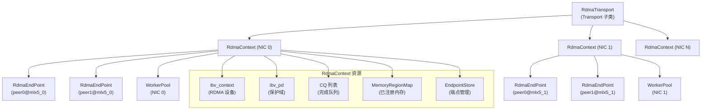

#### 3.3.2 RdmaTransport

**文件**: `include/transport/rdma_transport/rdma_transport.h`, `src/transport/rdma_transport/rdma_transport.cpp`

**关键方法**:

**install()**: 初始化 RDMA 资源并发布段描述符

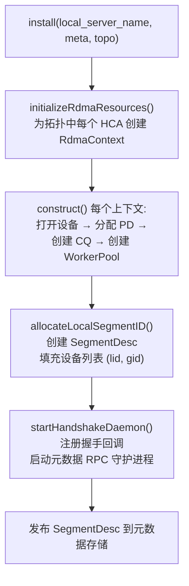

**registerLocalMemoryInternal()**: 注册内存到所有 RDMA Context

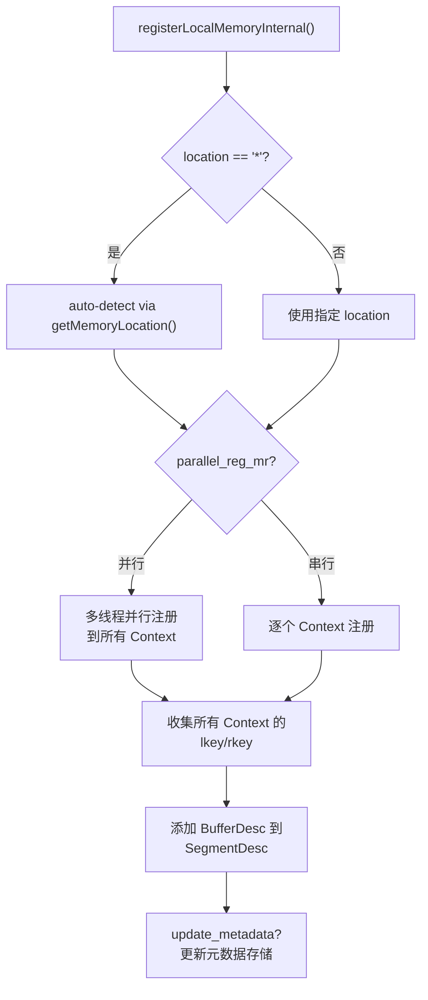

**submitTransferTask()**: 核心提交逻辑

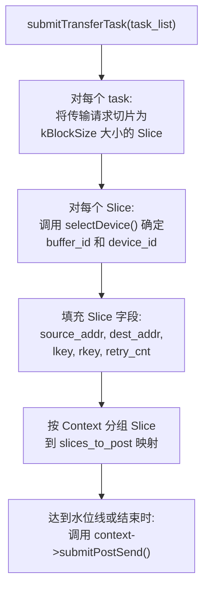

**selectDevice()**: NUMA 感知的设备选择

1. 遍历 SegmentDesc 中的 buffers，通过地址范围匹配确定 buffer_id
2. 根据源地址的 location（"cpu:0", "gpu:0" 等）查询拓扑
3. 调用 `topology->selectDevice()` 选择最优 HCA
4. 回退到通配符 location

#### 3.3.3 RdmaContext

**文件**: `include/transport/rdma_transport/rdma_context.h`, `src/transport/rdma_transport/rdma_context.cpp`

RdmaContext 代表一个本地 RDMA NIC 的所有资源。

**关键成员**:

```cpp
ibv_context *context_;                              // RDMA 设备上下文
ibv_pd *pd_;                                        // 保护域
ibv_comp_channel **comp_channel_;                    // 完成通道数组
std::vector<RdmaCq> cq_list_;                       // 完成队列列表
MemoryRegionMap memory_region_map_;                  // std::map<uintptr_t, MemoryRegionMeta>
std::shared_ptr<EndpointStore> endpoint_store_;      // RdmaEndPoint 管理
std::shared_ptr<WorkerPool> worker_pool_;            // 后台工作线程
```

**MemoryRegionMeta**:

```cpp
struct MemoryRegionMeta {
    void *addr;       // 起始地址（对 dmabuf 重要，mr->addr 可能不同）
    ibv_mr *mr;       // IBV 内存区域
};
```

**MemoryRegionMap**: `std::map<uintptr_t, MemoryRegionMeta>`，按地址排序，支持范围查找。`rkey()` 和 `lkey()` 通过 `upper_bound` 找到包含目标地址的 MR。

**registerMemoryRegion()**:
- 线程安全（RWSpinlock 保护）
- 支持 GPU 内存：当 nvidia-peermem 不可用时，使用 `ibv_reg_dmabuf_mr` 注册
- 支持 IBV relaxed ordering（检查 `ibv_reg_mr_iova2` 符号）

**construct()**: 初始化 RdmaContext

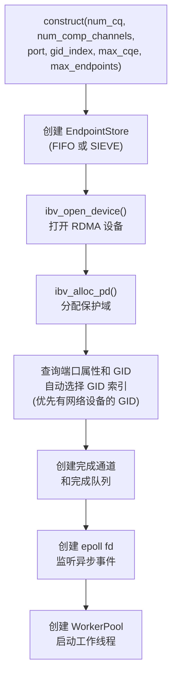

#### 3.3.4 RdmaEndPoint

**文件**: `include/transport/rdma_transport/rdma_endpoint.h`, `src/transport/rdma_transport/rdma_endpoint.cpp`

RdmaEndPoint 代表本地 NIC 和远端 NIC 之间的所有 QP 连接。

**状态机**:

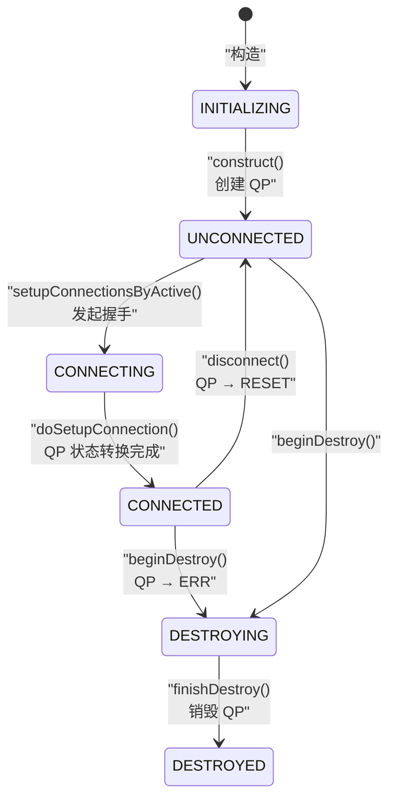

**QP 状态转换** (`doSetupConnection`):

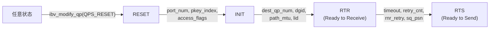

QP 属性设置:
- INIT: access_flags = LOCAL_WRITE | REMOTE_READ | REMOTE_WRITE | REMOTE_ATOMIC
- RTR: path_mtu（受 globalConfig 上限约束）, max_dest_rd_atomic=16, min_rnr_timer=12
- RTS: timeout=14, retry_cnt=7, rnr_retry=7, max_rd_atomic=16

**两阶段销毁**:

1. `beginDestroy()`: 设置 `active_=false`，`status_=DESTROYING`，将 QP 转为 ERR 状态使硬件刷出 inflight WR
2. `finishDestroy()`: 等待 WR 排空（30s 超时），销毁 QP（最多 3 次重试）

**并发握手保护**: 只有第一个线程从 UNCONNECTED 转为 CONNECTING，其他线程自旋等待（指数退避，最多 10s 超时），超时则重置连接。

#### 3.3.5 WorkerPool

**文件**: `include/transport/rdma_transport/worker_pool.h`, `src/transport/rdma_transport/worker_pool.cpp`

WorkerPool 管理后台线程，负责 RDMA 工作请求提交、CQ 轮询和异步事件处理。

**架构**:

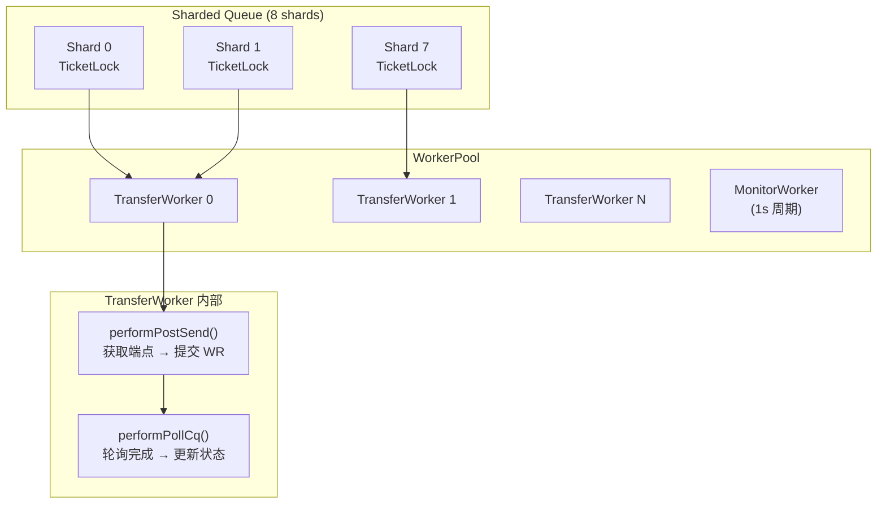

**submitPostSend 流程**:

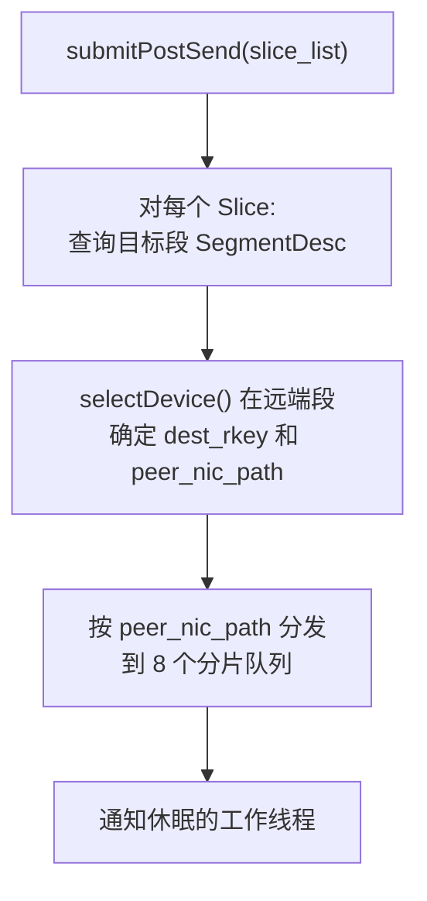

**TransferWorker 主循环**:

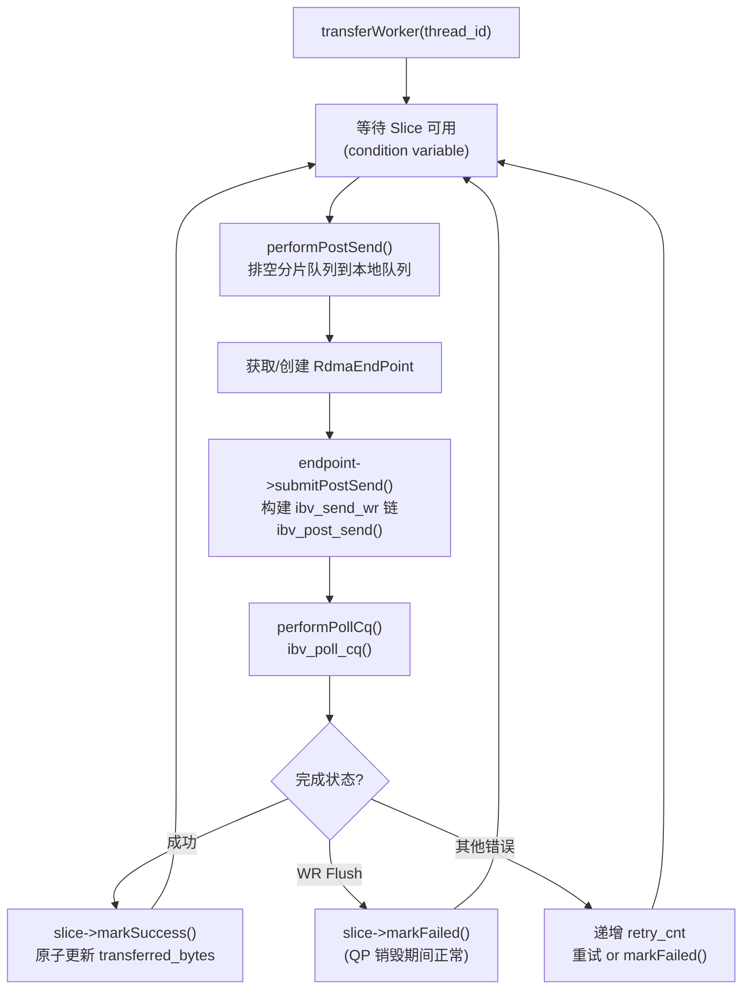

**MonitorWorker 周期性任务** (1s 间隔):
- 重新激活被标记为不活跃的 Context
- 回收已标记删除的 Endpoint
- 通过 epoll 处理 RDMA 异步事件：
  - `IBV_EVENT_QP_FATAL` → 标记 Endpoint 不活跃
  - `IBV_EVENT_DEVICE_FATAL` / `PORT_ERR` → 标记 Context 不活跃
  - `IBV_EVENT_PORT_ACTIVE` → 重新激活 Context

**Endpoint 提交 Post Send**:

`RdmaEndPoint::submitPostSend()` 将 Slice 分配到 QP：
1. 获取写锁
2. 将 Slice 按轮询方式分配到 QP，每个 QP 尊重 max_wr_depth 和 CQ 容量
3. 构建 `ibv_send_wr` 链，使用 RDMA_READ 或 RDMA_WRITE opcode
4. 调用 `ibv_post_send()`
5. 失败时遍历 bad_wr 链，添加到 failed_slice_list

### 3.4 RDMA 连接建立流程

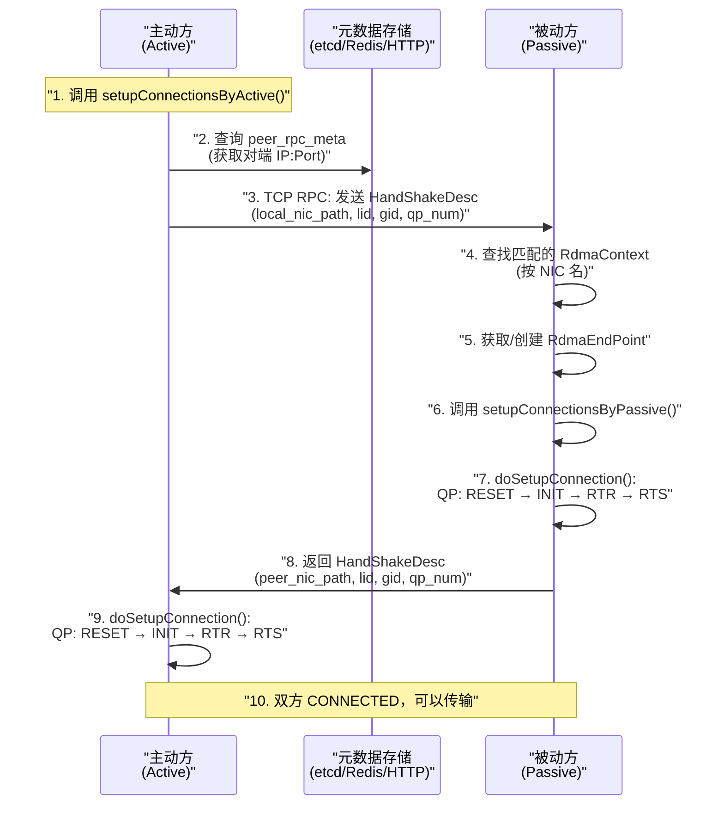

**HandShakeDesc 交换内容**:
- `local_nic_path`: 格式 `server@nic`（如 `worker1@mlx5_0`）
- `local_lid` / `local_gid`: 用于 QP 路由
- `qp_num`: QP 号列表（默认 2 个 QP per endpoint）
- `peer_nic_path`: 期望连接的对端 NIC

**eRDMA 特殊处理**: eRDMA QP 无法从 RTS 回到 RTS，因此在重连时调用 `reconstruct()` 而非 `disconnectUnlocked()`。

### 3.5 RDMA 数据传输完整流程

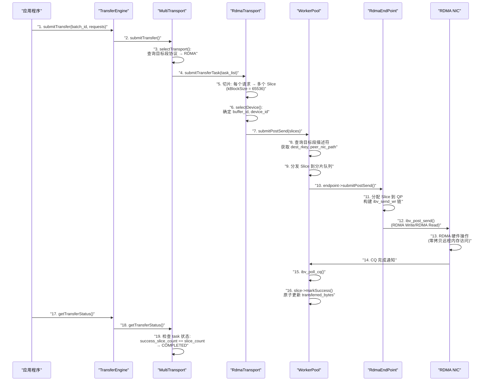

### 3.6 RDMA 错误处理

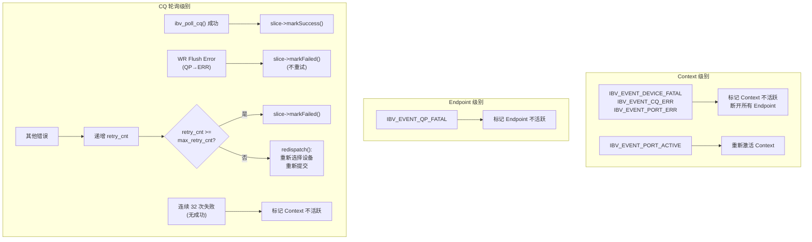

**死锁避免**: 在 `doProcessContextEvents()` 中，先 `ibv_ack_async_event()` 再调用 `set_active(false)`，避免在 `ibv_destroy_qp` 持有的端点锁上阻塞。

### 3.7 TCP Transport 实现

**文件**: `include/transport/tcp_transport/tcp_transport.h`, `src/transport/tcp_transport/tcp_transport.cpp`

TCP Transport 使用 ASIO 进行 TCP 连接，比 RDMA 简单得多。

**关键特性**:
- 当 `isTcpOnly()` 时，同主机传输使用本地 `memcpy` 而非 TCP 回环
- 可选连接池（`MC_TCP_ENABLE_CONNECTION_POOL=1`），60 秒空闲超时
- 每个 Slice 创建一个 ClientSession 进行异步传输

**TCP 传输流程**:

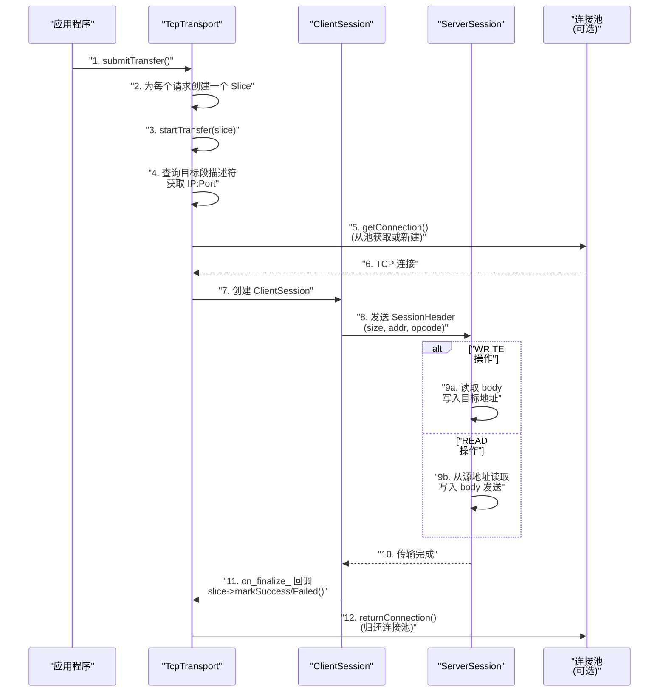

**SessionHeader 结构**:
- `size`: 传输数据大小
- `addr`: 目标/源地址
- `opcode`: READ 或 WRITE

**ServerSession**: 持久连接模式，处理完一个请求后等待同一连接上的下一个请求。

### 3.8 其他 Transport 实现

#### 3.8.1 EFA Transport (AWS)

**文件**: `include/transport/efa_transport/`

使用 AWS Elastic Fabric Adapter，基于 libfabric (ofi)。

**SRD 共享端点模型**:
- 每个 NIC 恰好一个 `fid_ep`，不随对端数量增长
- 对端是 AV (Address Vector) 中的 `fi_addr_t` 条目，`fi_av_insert` 为 O(1)
- 冷启动 ~ms/对端 vs 传统 ~35ms
- 扩展上限由 AV 容量（65536）决定，而非 768/NIC

**warmupSegment()**: 预填充所有 (local_ctx, peer_nic) 的 AV 条目，消除首次 `fi_av_insert` 延迟。

#### 3.8.2 NVLink Transport

**文件**: `include/transport/nvlink_transport/`, `include/transport/intranode_nvlink_transport/`

- 跨节点 GPU-to-GPU 传输（MNNVL fabric memory）
- 使用 IPC 共享内存映射进行地址重定位
- `relocateSharedMemoryAddress()` 将目标地址在节点间重映射

#### 3.8.3 CXL Transport

**文件**: `include/transport/cxl_transport/`

- CXL 附加内存的简单 memcpy 传输
- 检查地址是否在 CXL 映射范围内
- Slice union 中 `cxl` 变体仅包含 `void* dest_addr`

#### 3.8.4 NVMe-oF Transport

**文件**: `include/transport/nvmeof_transport/`

- 使用 NVIDIA GDS (GPUDirect Storage) / cuFile API
- `CuFileContext`: 包装 `CUfileHandle_t`，用 O_DIRECT 打开文件
- `CUFileDescPool`: 对象池复用 `CUfileBatchHandle_t`（设置开销大）
- 最大 256 描述符

#### 3.8.5 HIP Transport (AMD ROCm)

**文件**: `include/transport/hip_transport/`

- AMD GPU 传输，使用 HIP 运行时
- `StreamPool`: 每设备轮询分配的 `hipStream_t` 池
- `EventPool`: 每设备 `hipEvent_t` 池，get/put 回收
- `PendingTransfer`: 跟踪异步 HIP 拷贝

#### 3.8.6 Ascend Direct Transport (华为)

**文件**: `include/transport/ascend_transport/ascend_direct_transport/`

- 华为 Ascend NPU 的单边 RDMA 传输
- `TransferExecutorBase`: 多态执行器（同步/异步）
- `ISliceDispatcher`: Slice 分发策略模式

#### 3.8.7 Barex Transport (平头哥)

**文件**: `include/transport/barex_transport/`

- 使用 ACCL/Barex 库的 RDMA 传输
- `ChannelCache`: SegmentID → (nic_id → XChannel*) 映射
- 通道健康监控: `CheckAllChannels()`, `RemoveInvalidChannels()`

#### 3.8.8 UB Transport (华为鲲鹏)

**文件**: `include/transport/kunpeng_transport/`

- 华为鲲鹏 Ultra-Bus 协议
- 两种端点类型: `URMA_ENDPOINT`（默认）, `OBMM_ENDPOINT`
- `UbSIEVEEndpointStore`: 基于 NSDI '24 SIEVE 缓存算法的端点管理
- `UbWorkerPool`: 8 分片工作池，per-shard TicketLock

### 3.9 Memory Location 检测

**文件**: `include/memory_location.h`, `src/memory_location.cpp`

`getMemoryLocation()` 确定内存所在位置：

```mermaid
flowchart TD
    A["getMemoryLocation(start, len)"] --> B{"CUDA/ROCm/HIP<br/>已编译?"}
    B -->|是| C["cudaPointerGetAttributes()"]
    C --> D{"cudaMemoryTypeDevice?"}
    D -->|是| E["返回 'cuda:N'"]
    D -->|否| F["继续 CPU 检测"]
    B -->|否| F
    F --> G["numa_move_pages()<br/>查询每页的 NUMA 节点"]
    G --> H["合并连续同 NUMA 页<br/>为单个条目"]
    H --> I["返回 'cpu:N'"]
    G -->|失败| J["返回 '*' (通配符)"]
```

**Segments Location 编码**: `"segments:<page_size>:<numa0>,<numa1>,..."`
- 示例: `"segments:4096:1,3,5,7"`
- 缓冲区等分为 N 个区域，区域 i 绑定到 NUMA 节点 numa[i]

### 3.10 元数据存储插件实现

#### 3.10.1 EtcdStoragePlugin

两种实现：
- Legacy: 使用 `etcd::SyncClient`（etcd-cpp-api-v3）
- New: 使用 Go 编译的 c-shared 库（`mooncake-common/etcd/etcd_wrapper.go`）

Go etcd wrapper 提供：
- 全局客户端（Transfer Engine 用）和 Store 客户端
- 租约管理: `EtcdStoreGrantLeaseWrapper`, `EtcdStoreKeepAliveWrapper`
- Watch 功能: `EtcdStoreWatchWithPrefixFromRevisionWrapper`
- 事务操作
- 专用 snapshot 客户端（支持最大 2GB 载荷）

#### 3.10.2 RedisStoragePlugin

- 使用 hiredis 库
- 线程安全（mutex 保护）
- 支持 AUTH 和 DB 选择（`MC_REDIS_USERNAME`, `MC_REDIS_PASSWORD`, `MC_REDIS_DB_INDEX`）

#### 3.10.3 HTTPStoragePlugin

- RESTful GET/PUT/DELETE via curl
- 线程本地 curl handle
- 3s 超时，1.5s 连接超时
- URL 编码 key

#### 3.10.4 SocketHandShakePlugin

TCP socket 握手通信：
- `startDaemon()`: 绑定/监听端口，后台线程接收连接
- 支持四种回调类型: Connection, Metadata, Notify, Probe
- 读取 JSON 消息，分发到注册的回调，写回响应
- 支持 IPv4 和 IPv6（`MC_USE_IPV6`）

### 3.11 C API

**文件**: `include/transfer_engine_c.h`

C API 为 Rust/Go 等语言提供 FFI 接口。

**核心类型**:

```c
#define segment_handle_t int32_t
#define segment_id_t int32_t
#define batch_id_t uint64_t
#define LOCAL_SEGMENT (0)
#define INVALID_BATCH UINT64_MAX
#define OPCODE_READ (0)
#define OPCODE_WRITE (1)
```

**核心函数**:

```c
transfer_engine_t createTransferEngine(metadata_conn_string, local_server_name,
                                       ip_or_host_name, rpc_port, auto_discover);
transport_t installTransport(engine, proto, args);
segment_id_t openSegment(engine, segment_name);
int registerLocalMemory(engine, addr, length, location, remote_accessible);
batch_id_t allocateBatchID(engine, batch_size);
int submitTransfer(engine, batch_id, entries, count);
int getTransferStatus(engine, batch_id, task_id, status);
int freeBatchID(engine, batch_id);
void destroyTransferEngine(engine);
```

**EFA 预热**: `warmupEfaSegment()` 预连接所有 EFA 端点，消除首次 `fi_av_insert` 延迟（16 NIC × N 对端约 6s）。

### 3.12 TENT — 下一代传输引擎

**文件**: `mooncake-transfer-engine/tent/`

TENT 是并行开发的下一代传输引擎，通过 `MC_USE_TENT` 或 `MC_USE_TEV1` 环境变量激活。

#### 3.12.1 TENT vs 经典 TE 对比

| 特性 | 经典 TE | TENT |
|------|---------|------|
| 传输抽象 | Slice + TransferTask | SubBatch + SubTask |
| 协议选择 | 单协议 | 多协议优先级 + 故障转移 |
| 跨协议传输 | 不支持 | Staging Proxy（Beta） |
| 元数据缓存 | 读写锁双检 | TTL + 订阅式失效通知 |
| 配置 | 环境变量 | JSON 配置 + 环境变量 |
| 拓扑 | NUMA→HCA 映射 | richer: NicType, MemType, RangeLocation |
| 设备支持 | 编译时 | 运行时 Device Plugin |
| 通知 | 基本支持 | 原生通知 QP |

#### 3.12.2 TENT 核心架构

```mermaid
graph TB
    subgraph "TENT API Layer"
        TE_API["tent::TransferEngine<br/>(C + C++ API)"]
    end

    subgraph "TENT Core"
        IMPL["TransferEngineImpl"]
        SM["SegmentManager<br/>(TTL 缓存 + 订阅失效)"]
        CP["ControlService<br/>(coro_rpc)"]
        PM["ProxyManager<br/>(跨协议 Staging)"]
    end

    subgraph "TENT Transport"
        TR["tent::Transport<br/>(SubBatch 模型)"]
        RDMAT["RdmaTransport"]
        OTHERT["其他 Transport..."]
    end

    subgraph "Device Plugins"
        CUDA_P["CUDA Plugin"]
        ROCM_P["ROCm Plugin"]
    end

    TE_API --> IMPL
    IMPL --> SM
    IMPL --> CP
    IMPL --> PM
    IMPL --> TR
    TR --> RDMAT
    TR --> OTHERT
    IMPL --> CUDA_P
    IMPL --> ROCM_P
```

#### 3.12.3 TENT 关键特性

**TransportType 枚举**: RDMA, MNNVL, SHM, NVLINK, GDS, IOURING, TCP, AscendDirect, SUNRISE_LINK, UNSPEC

**Capabilities 结构**: 每个 Transport 报告其能力：
```cpp
struct Capabilities {
    bool dram_to_dram;
    bool dram_to_gpu;
    bool gpu_to_dram;
    bool gpu_to_gpu;
    bool dram_to_file;
    bool gpu_to_file;
};
```

**故障转移**: `max_failover_attempts_`（默认 3）次跨协议重试。`resolveTransport()` 根据优先级选择传输，失败后失效并尝试下一个。

**Staging Proxy** (Beta): 当源和目标之间无直接传输路径时，通过中间缓冲区分阶段传输。默认 8MB chunk，32 个 chunk，8 个分片工作队列。

**SegmentManager 缓存**:
- `withCachedSegment()`: 模板方法，自动缓存失效/重试
- `RemoteSegmentCache`: 线程本地缓存，TTL 可配（默认 10s）
- `addSubscriber()`: 注册对端 RPC 地址，主动推送缓存失效通知

**Device Plugin**: C 兼容插件接口，运行时加载：
```c
struct device_plugin_t {
    void* (*alloc)(size_t);
    void (*free)(void*);
    void (*memcpy_sync)(void* dst, const void* src, size_t);
    int (*query_location)(void* addr, size_t len, ...);
    int (*get_device_count)();
    void (*get_device_pci_bus_id)(int, char*);
};
```

### 3.13 典型使用模式

#### 3.13.1 基本 TE 使用流程

```mermaid
flowchart TD
    A["1. 创建 TransferEngine"] --> B["2. init(metadata_server,<br/>local_server_name)"]
    B --> C["3. installTransport('rdma', args)<br/>installTransport('tcp', args)"]
    C --> D["4. 分配内存<br/>registerLocalMemory(addr, len, location)"]
    D --> E["5. openSegment(peer_name)<br/>获取 SegmentID"]
    E --> F["6. allocateBatchID(batch_size)"]
    F --> G["7. 构建 TransferRequest 列表:<br/>opcode, source, target_id,<br/>target_offset, length"]
    G --> H["8. submitTransfer(batch_id, requests)"]
    H --> I["9. 轮询 getTransferStatus()<br/>直到 COMPLETED/FAILED"]
    I --> J{"状态?"}
    J -->|"COMPLETED"| K["10a. 处理结果"]
    J -->|"FAILED"| L["10b. 错误处理"]
    J -->|"PENDING"| I
    K --> M["11. freeBatchID(batch_id)"]
    L --> M
```

#### 3.13.2 带 Notify 的使用流程

```mermaid
sequenceDiagram
    participant S as "发送方 (Source)"
    participant R as "接收方 (Target)"

    Note over S,R: "初始化阶段"
    S->>S: "init + installTransport + registerMemory"
    R->>R: "init + installTransport + registerMemory"

    Note over S,R: "传输阶段"
    S->>S: "submitTransferWithNotify(<br/>batch_id, requests, notify_msg)"
    S->>S: "轮询 getTransferStatus() → COMPLETED"
    S->>S: "自动发送 Notify 到 Target"

    R->>R: "getNotifies(notifies)<br/>获取通知并处理"

    Note over S,R: "清理阶段"
    S->>S: "freeBatchID()"
```

#### 3.13.3 P2P 模式使用流程

P2P 模式使用 `"P2PHANDSHAKE"` 作为连接字符串，无需中心化元数据服务器：

1. `init("P2PHANDSHAKE", local_server_name)` — 不创建存储插件
2. `installTransport()` — 安装传输协议
3. `registerLocalMemory()` — 注册内存，自动发布段描述符
4. 段描述符通过 TCP 握手直接在对端间交换
5. 其余流程与标准模式相同

---

## 4. Mooncake Store 架构概览

### 4.1 Master-Worker 模型

```mermaid
graph TB
    subgraph "Master 节点"
        MS["MasterService<br/>(中心化管理)"]
        RPC["coro_rpc 服务"]
        HTTP_A["HTTP 管理接口"]
        SEG["SegmentManager<br/>(内存分配)"]
        REPL["Replica Manager<br/>(副本管理)"]
        EVICT["Eviction Strategy<br/>(淘汰策略)"]
    end

    subgraph "Client 节点"
        RC["RealClient<br/>(完整功能)"]
        DC["DummyClient<br/>(本地内存池)"]
        BUF["BufferAllocator<br/>(内存分配器)"]
    end

    subgraph "存储后端"
        MEM["MEMORY 副本"]
        DISK["DISK 副本"]
        SSD["LOCAL_DISK 副本"]
    end

    MS --> RPC
    MS --> HTTP_A
    MS --> SEG
    MS --> REPL
    MS --> EVICT

    RC -->|"RPC"| MS
    DC -->|"RPC"| MS
    RC --> BUF

    REPL --> MEM
    REPL --> DISK
    REPL --> SSD
```

### 4.2 副本生命周期

```mermaid
stateDiagram-v2
    [*] --> INITIALIZED : "创建"
    INITIALIZED --> PROCESSING : "开始写入"
    PROCESSING --> COMPLETE : "写入完成"
    COMPLETE --> REMOVED : "淘汰/删除"
    PROCESSING --> REMOVED : "写入失败"
```

### 4.3 高可用架构

```mermaid
graph TB
    subgraph "Active Master"
        AM["MasterService<br/>(活跃)"]
        OL["Oplog<br/>(操作日志)"]
        SNAP["Snapshot<br/>(快照)"]
    end

    subgraph "Standby Master"
        SM["HotStandbyService<br/>(热备)"]
        SSM["StandbyStateMachine"]
    end

    subgraph "HA 后端"
        ETCD_HA["etcd<br/>(领导者选举)"]
        REDIS_HA["Redis"]
        K8S_HA["K8s Lease"]
    end

    AM --> OL
    OL --> SNAP
    AM -->|"oplog 复制"| SM
    SM --> SSM
    AM -->|"leader election"| ETCD_HA
    SM -->|"watch/follow"| ETCD_HA
```

---

## 5. Python 绑定

### 5.1 Transfer Engine Python API

- `TransferEnginePy.initialize(local_hostname, metadata_server, protocol, device_name)`
- `registerMemory(buffer_addr, capacity)`
- `transferSyncWrite/Read(target_hostname, buffer, peer_buffer_address, length)`
- `batchTransferAsyncWrite/Read(...)` — 异步批量传输
- `batchTransferOnCuda(...)` — CUDA 流感知传输
- `allocateManagedBuffer(length)` / `freeManagedBuffer()` — buddy 分配器管理缓冲区

### 5.2 Store Python API

- `setup_real(...)` / `setup_dummy(...)` — 初始化客户端
- `put(key, value)` / `get_into(key, buffer, size)` / `remove(key)` — 基本 KV 操作
- `put_from(key, buffer, size)` / `get_buffer(key)` — 零拷贝变体
- `batch_put_from/batch_get_into` — 批量操作
- `upsert/upsert_from` — 插入或更新
- `create_copy_task/create_move_task` — 异步数据移动任务

---

## 6. 构建和开发

### 6.1 构建

```bash
# 安装依赖
sudo bash dependencies.sh

# 完整构建
mkdir build && cd build
cmake .. -DUSE_HTTP=ON -DUSE_ETCD=ON
make -j$(nproc)
sudo make install
```

### 6.2 关键 CMake 选项

| 选项 | 默认 | 说明 |
|------|------|------|
| `WITH_TE` | ON | 构建传输引擎 |
| `WITH_STORE` | ON | 构建 Mooncake Store |
| `USE_CUDA` | OFF | NVIDIA GPU |
| `USE_HIP` | OFF | AMD ROCm |
| `USE_ASCEND` | OFF | 华为 Ascend |
| `USE_EFA` | OFF | AWS EFA |
| `USE_CXL` | OFF | CXL |
| `USE_TENT` | OFF | TENT 引擎 |
| `BUILD_UNIT_TESTS` | ON | 单元测试 |
| `ENABLE_ASAN` | OFF | Address Sanitizer |
| `ENABLE_MULTI_PROTOCOL` | OFF | 多协议支持 |

### 6.3 代码格式

```bash
# 检查格式 (需要 clang-format-20)
./scripts/code_format.sh --check

# 格式化修改的文件
./scripts/code_format.sh

# 格式化所有文件
./scripts/code_format.sh --all
```

C++ 风格: Google-based，4 空格缩进，80 列限制。
Python: ruff (lint + format)。
Pre-commit: `pip install -r requirements-dev.txt && pre-commit install`

### 6.4 测试

```bash
# C++ 单元测试
cd build && ctest --output-on-failure
ctest -R <test_name> --output-on-failure  # 单个测试

# Python 集成测试
cd mooncake-wheel/tests
bash ../../scripts/run_tests.sh
```

注意: RDMA 测试（`rdma_transport_test`, `rdma_loopback_test`）未注册到 CTest，需手动运行且需要 RDMA 硬件。