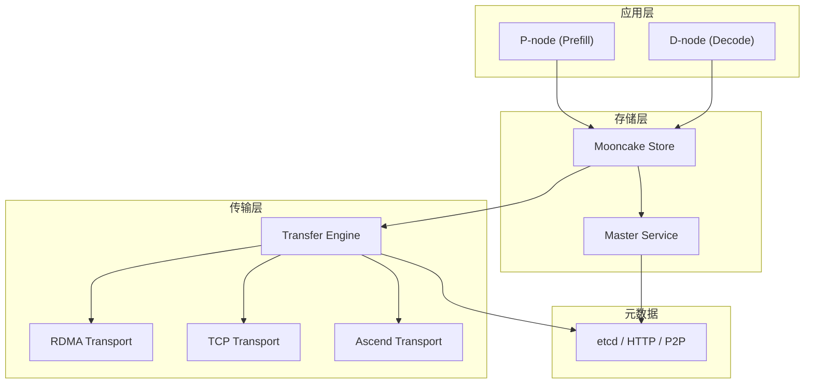
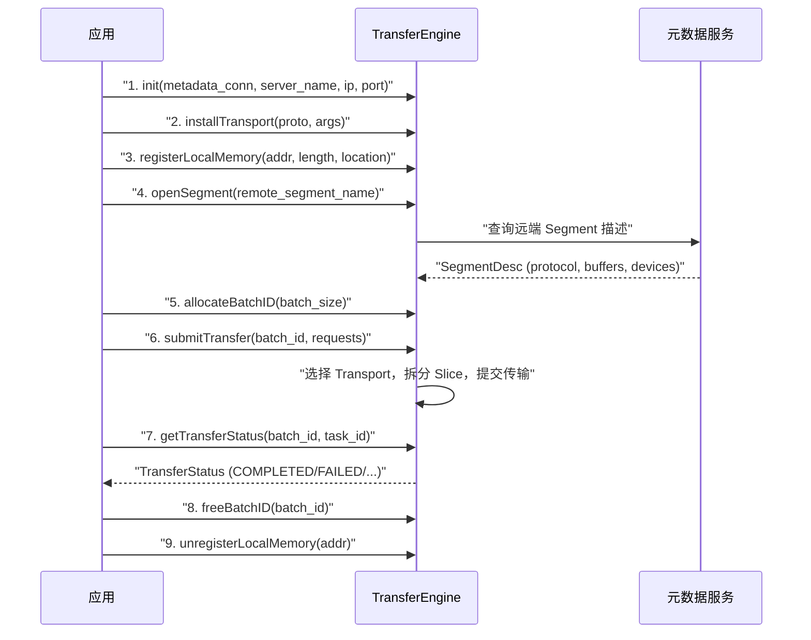
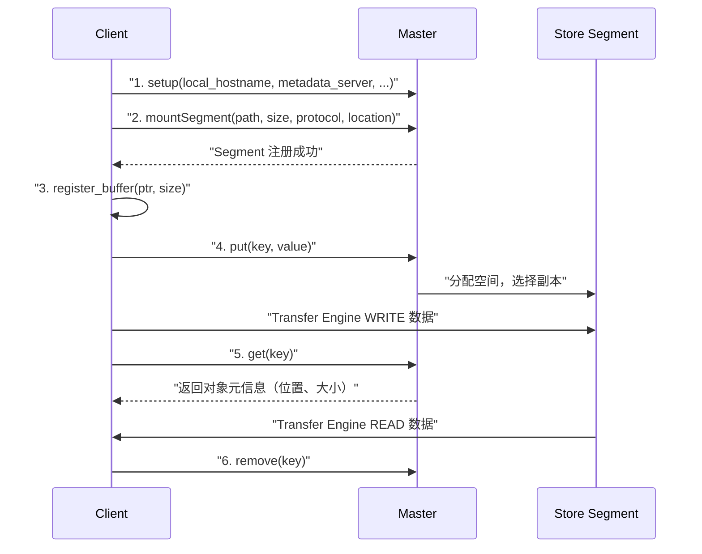
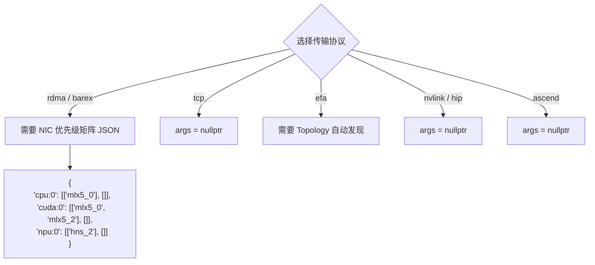
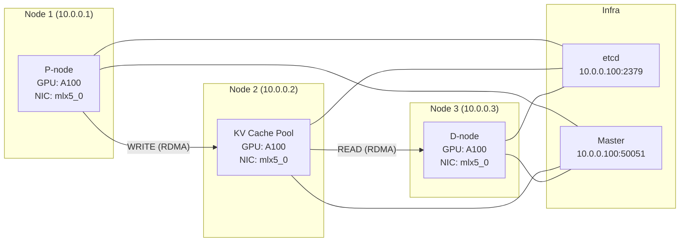
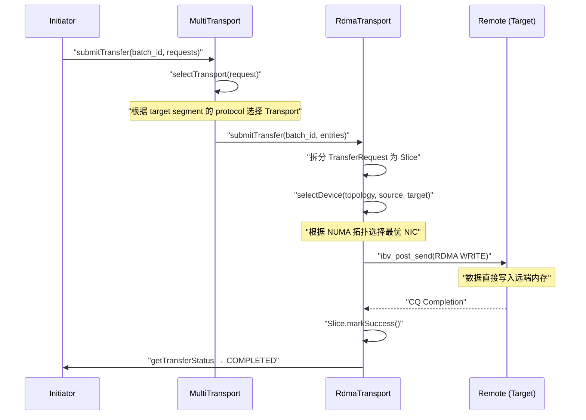
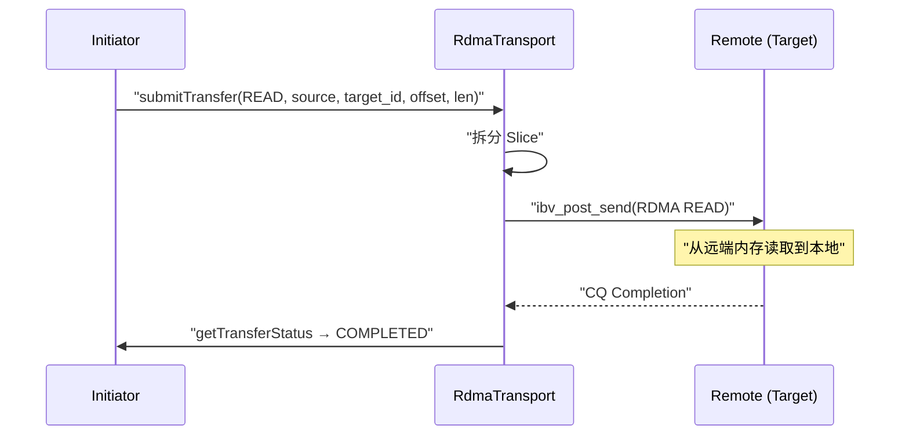
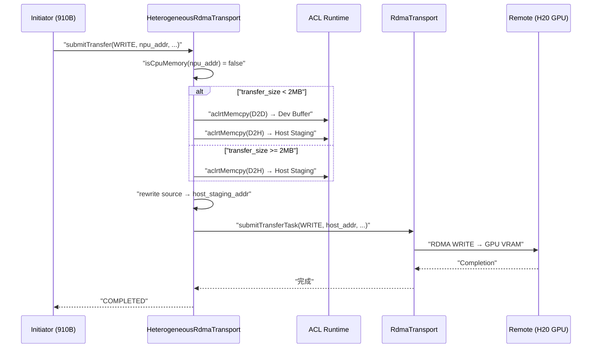

# Mooncake 使用指南：从零搭建到实战

## 1. 整体架构速览

Mooncake 由两大核心组件构成：

| 组件 | 作用 | 典型场景 |
|------|------|---------|
| **Transfer Engine** | 底层数据传输引擎，支持 RDMA/TCP/EFA 等多种传输协议 | KV Cache 迁移、模型权重同步 |
| **Store** | 分布式 KVCache 存储引擎，构建在 Transfer Engine 之上 | Prefill/Decode 分离架构中的共享 KV Cache 池 |



---

## 2. 编译安装

### 2.1 安装依赖

```bash
sudo bash dependencies.sh
```

### 2.2 全量编译（包含 Store + Transfer Engine）

```bash
mkdir build && cd build
cmake .. -DUSE_HTTP=ON -DUSE_ETCD=ON -DUSE_CUDA=ON
make -j$(nproc)
sudo make install
```

### 2.3 仅编译 Transfer Engine

```bash
cd mooncake-transfer-engine && mkdir build && cd build
cmake .. -DUSE_CUDA=ON
make -j$(nproc)
```

### 2.4 关键 CMake 编译选项

| 选项 | 说明 | 适用场景 |
|------|------|---------|
| `-DUSE_CUDA=ON` | NVIDIA GPU 支持 + GPU Direct RDMA | NVIDIA GPU 集群 |
| `-DUSE_HIP=ON` | AMD ROCm GPU 支持 | AMD GPU 集群 |
| `-DUSE_ASCEND=ON` | 华为 Ascend NPU 支持（HCCL Transport） | Ascend NPU 集群 |
| `-DUSE_ASCEND_HETEROGENEOUS=ON` | Ascend NPU ↔ NVIDIA GPU 异构传输 | NPU+GPU 混合集群 |
| `-DUSE_EFA=ON` | AWS EFA 网络支持 | AWS 云 |
| `-DUSE_CXL=ON` | CXL 内存支持 | CXL 内存池 |
| `-DUSE_TENT=ON` | TENT 新一代传输引擎 | 实验性部署 |
| `-DWITH_EP=ON` | Expert Parallelism | MoE 模型 |
| `-DWITH_P2P_STORE=ON` | Go 实现的 P2P Store | Go 生态集成 |
| `-DBUILD_UNIT_TESTS=ON` | 构建单元测试 | 开发调试 |

### 2.5 Python Wheel 安装

```bash
bash scripts/build_wheel.sh
pip install dist/mooncake_transfer_engine-*.whl
```

---

## 3. Master Service 部署

Store 的所有客户端需要先连接 Master Service。

### 3.1 配置文件方式

```yaml
# master.yaml
rpc_port: 50051
rpc_thread_num: 4
rpc_address: "0.0.0.0"
default_kv_lease_ttl: 5000
eviction_ratio: 0.1
eviction_high_watermark_ratio: 1.0
enable_ha: false
enable_metric_reporting: true
metrics_port: 9003
enable_http_metadata_server: false
http_metadata_server_port: 8080
http_metadata_server_host: "0.0.0.0"
```

### 3.2 启动 Master

```bash
# 使用配置文件
./mooncake-store-master --config_path=master.yaml

# 使用命令行参数
./mooncake-store-master \
    --rpc_port=50051 \
    --rpc_thread_num=4 \
    --enable_metric_reporting=true \
    --metrics_port=9003

# 启用 HTTP 元数据服务器（替代 etcd）
./mooncake-store-master \
    --enable_http_metadata_server=true \
    --http_metadata_server_port=8080

# 启用 HA（需要 etcd）
./mooncake-store-master \
    --enable_ha=true \
    --ha_backend_type=etcd \
    --etcd_endpoints="http://10.0.0.100:2379" \
    --cluster_id="mooncake_cluster"
```

### 3.3 元数据服务器选择

| 类型 | 连接串格式 | 说明 |
|------|-----------|------|
| etcd | `etcd://10.0.0.100:2379` | 生产推荐，强一致性 |
| HTTP | `http://10.0.0.100:8080/metadata` | 轻量级，需 Master 启用 HTTP 元数据 |
| P2P 握手 | `P2PHANDSHAKE` | 无需外部服务，点对点直连 |
| Redis | `redis://10.0.0.100:6379` | 可选 |

---

## 4. Transfer Engine 使用

### 4.1 核心 API

#### C++ API（`TransferEngine` 类）



**API 详解**：

| 方法 | 说明 | 关键参数 |
|------|------|---------|
| `init(conn_string, server_name, ip, port)` | 初始化引擎，连接元数据服务 | `conn_string`: 元数据连接串 |
| `installTransport(proto, args)` | 安装传输层 | `proto`: "rdma"/"tcp"/"ascend"/"efa" 等 |
| `registerLocalMemory(addr, length, location)` | 注册本地内存 | `location`: "cpu:0"/"cuda:0"/"npu:0" |
| `openSegment(segment_name)` | 打开远端 Segment | 返回 `SegmentID` |
| `allocateBatchID(batch_size)` | 分配批处理 ID | `batch_size`: 最大并发传输数 |
| `submitTransfer(batch_id, entries)` | 提交传输请求 | `TransferRequest{opcode, source, target_id, target_offset, length}` |
| `getTransferStatus(batch_id, task_id)` | 查询传输状态 | 返回 `TransferStatus{s, transferred_bytes}` |
| `freeBatchID(batch_id)` | 释放批处理 ID | - |

**TransferRequest 结构**：

```cpp
struct TransferRequest {
    OpCode opcode;       // READ 或 WRITE
    void *source;        // 本地内存地址
    SegmentID target_id; // 远端 Segment ID
    uint64_t target_offset; // 远端偏移量
    size_t length;       // 传输字节数
};
```

**TransferStatus 枚举**：

| 状态 | 含义 |
|------|------|
| `WAITING` | 等待调度 |
| `PENDING` | 正在传输 |
| `COMPLETED` | 传输完成 |
| `FAILED` | 传输失败 |
| `TIMEOUT` | 传输超时 |
| `CANCELED` | 传输取消 |
| `INVALID` | 无效请求 |

### 4.2 C++ 完整示例

**Target 端**（被动方，注册内存等待远端访问）：

```cpp
#include "transfer_engine.h"

int main() {
    mooncake::TransferEngine engine;

    // 1. 初始化
    engine.init("etcd://10.0.0.100:2379",  // 元数据服务
                "10.0.0.2:12345",           // 本机 server_name
                "10.0.0.2",                 // 本机 IP
                12345);                     // RPC 端口

    // 2. 安装 RDMA 传输层
    void *args[] = {
        (void*)"{"cpu:0":[[\"mlx5_0\"],[]],\"cuda:0":[[\"mlx5_0\"],[]]}",
        nullptr
    };
    engine.installTransport("rdma", args);

    // 3. 分配并注册内存
    size_t buffer_size = 1ULL << 30; // 1GB
    void *buffer = numa_alloc_onnode(buffer_size, 0);
    engine.registerLocalMemory(buffer, buffer_size, "cpu:0");

    // Target 保持运行
    while (true) sleep(1);

    engine.unregisterLocalMemory(buffer);
    return 0;
}
```

**Initiator 端**（主动方，发起传输）：

```cpp
#include "transfer_engine.h"

int main() {
    mooncake::TransferEngine engine;
    engine.init("etcd://10.0.0.100:2379",
                "10.0.0.1:12346",
                "10.0.0.1", 12346);

    // 安装 RDMA 传输层
    void *args[] = {
        (void*)"{"cpu:0":[[\"mlx5_0\"],[]],\"cuda:0":[[\"mlx5_0\"],[]]}",
        nullptr
    };
    engine.installTransport("rdma", args);

    // 注册本地内存
    size_t buffer_size = 1ULL << 30;
    void *src_buffer = numa_alloc_onnode(buffer_size, 0);
    engine.registerLocalMemory(src_buffer, buffer_size, "cpu:0");

    // 打开远端 Segment
    auto segment_id = engine.openSegment("10.0.0.2:12345");

    // 获取远端 buffer 基址
    auto desc = engine.getMetadata()->getSegmentDescByID(segment_id);
    uint64_t remote_base = (uint64_t)desc->buffers[0].addr;

    // 提交 WRITE 传输
    auto batch_id = engine.allocateBatchID(1);
    std::vector<mooncake::TransferRequest> requests;
    mooncake::TransferRequest req;
    req.opcode = mooncake::TransferRequest::WRITE;
    req.source = src_buffer;
    req.target_id = segment_id;
    req.target_offset = remote_base;
    req.length = 65536;
    requests.push_back(req);

    engine.submitTransfer(batch_id, requests);

    // 等待完成
    mooncake::TransferStatus status;
    while (true) {
        engine.getTransferStatus(batch_id, 0, status);
        if (status.s == mooncake::TransferStatusEnum::COMPLETED) break;
        if (status.s == mooncake::TransferStatusEnum::FAILED) exit(1);
    }

    engine.freeBatchID(batch_id);
    engine.unregisterLocalMemory(src_buffer);
    return 0;
}
```

### 4.3 Python API

```python
from mooncake.engine import TransferEngine

engine = TransferEngine()

# 初始化
ret = engine.initialize(
    server_name="10.0.0.1:12346",    # 本机 server_name
    metadata_server="etcd://10.0.0.100:2379",  # 元数据服务
    protocol="rdma",                  # 传输协议
    device_name=""                    # RDMA 设备名（空=自动发现）
)

# 分配 buffer
src_addr = engine.allocate_managed_buffer(64 * 1024 * 1024)

# 写入数据
engine.write_bytes_to_buffer(src_addr, b"Hello Mooncake", 14)

# 同步写入到远端
dst_addr = engine.get_first_buffer_address("10.0.0.2:12345")
engine.transfer_sync_write("10.0.0.2:12345", src_addr, dst_addr, 14)

# 同步从远端读取
engine.transfer_sync_read("10.0.0.2:12345", src_addr, dst_addr, 14)

# 批量异步传输
batch_id = engine.batch_transfer_async_write(
    "10.0.0.2:12345",
    [src_addr + i * 1024 for i in range(100)],
    [dst_addr + i * 1024 for i in range(100)],
    [1024] * 100
)
engine.get_batch_transfer_status([batch_id])

# 探测对端存活
engine.send_probe("10.0.0.2:12345")

# 清理
engine.free_managed_buffer(src_addr, 64 * 1024 * 1024)
```

### 4.4 C API

```c
#include "transfer_engine_c.h"

transfer_engine_t engine = createTransferEngine(
    "etcd://10.0.0.100:2379",  /* metadata_conn_string */
    "10.0.0.1:12346",          /* local_server_name */
    "10.0.0.1",                /* ip_or_host_name */
    12346,                     /* rpc_port */
    0                          /* auto_discover */
);

installTransport(engine, "rdma", args);

void *buffer = malloc(buffer_size);
registerLocalMemory(engine, buffer, buffer_size, "cpu:0", 1);

segment_id_t seg_id = openSegment(engine, "10.0.0.2:12345");

batch_id_t batch_id = allocateBatchID(engine, 1);

struct transfer_request req = {
    .opcode = OPCODE_WRITE,
    .source = buffer,
    .target_id = seg_id,
    .target_offset = 0,
    .length = 65536
};
submitTransfer(engine, batch_id, &req, 1);

struct transfer_status status;
while (1) {
    getTransferStatus(engine, batch_id, 0, &status);
    if (status.status == STATUS_COMPLETED) break;
    if (status.status == STATUS_FAILED) exit(1);
}

freeBatchID(engine, batch_id);
unregisterLocalMemory(engine, buffer);
destroyTransferEngine(engine);
```

---

## 5. Mooncake Store 使用

### 5.1 Store 交互流程



### 5.2 Python Store API

```python
from mooncake.store import MooncakeDistributedStore

store = MooncakeDistributedStore()

# 初始化（连接 Master 和元数据服务）
store.setup(
    local_hostname="10.0.0.1",                  # 本机主机名
    metadata_server="http://10.0.0.100:8080/metadata",  # 元数据服务
    global_segment_size=3200 * 1024 * 1024,     # 全局 Segment 大小
    local_buffer_size=512 * 1024 * 1024,        # 本地缓冲区大小
    protocol="rdma",                            # 传输协议: "rdma" / "tcp"
    device_name="mlx5_0",                       # RDMA 设备名
    master_server_address="10.0.0.100:50051"    # Master 地址
)

# ---- 基本操作 ----
store.put("key1", b"Hello Mooncake")          # 写入
data = store.get("key1")                       # 读取
store.remove("key1")                           # 删除
store.is_exist("key1")                         # 是否存在
store.get_size("key1")                         # 获取大小

# ---- 零拷贝操作 ----
import ctypes
buffer = (ctypes.c_ubyte * 1024)()
ptr = ctypes.addressof(buffer)
store.register_buffer(ptr, 1024)               # 注册 buffer

ctypes.memmove(buffer, b"zero-copy data", 14)
store.put_from("key2", ptr, 14)                # 零拷贝写入
store.get_into("key2", ptr, 1024)              # 零拷贝读取
store.unregister_buffer(ptr)                   # 注销 buffer

# ---- 批量操作 ----
store.batch_put_from(["k1", "k2"], [ptr1, ptr2], [sz1, sz2])
store.batch_get_into(["k1", "k2"], [ptr1, ptr2], [sz1, sz2])
store.batch_is_exist(["k1", "k2"])
store.batch_get_buffer(["k1", "k2"])

# ---- 范围读取 ----
store.get_into_ranges(
    [ptr1, ptr2],                              # buffer 列表
    [["key1", "key2"], ["key2", "key1"]],      # 每个 buffer 读取的 key
    [[[0], [8]], [[4], [16]]],                 # dst_offsets
    [[[0], [2]], [[4], [10]]],                 # src_offsets
    [[[4], [5]], [[6], [4]]]                   # sizes
)

# ---- 副本配置 ----
from mooncake.store import ReplicateConfig
config = ReplicateConfig()
config.replica_num = 3
config.with_soft_pin = True
config.preferred_segment = "10.0.0.2:12345"
store.put("key3", b"replicated data", config)

# ---- 清理 ----
store.close()
```

---

## 6. 传输协议选择指南

### 6.1 场景→协议映射

| 场景 | 推荐协议 | 原因 |
|------|---------|------|
| 同机房 NVIDIA GPU 集群 | `rdma` | GPU Direct RDMA，零拷贝，最低延迟 |
| 同机房 CPU 机器间 | `rdma` | RDMA WRITE/READ，绕过内核 |
| 跨机房 / 无 RDMA | `tcp` | TCP 通用，ASIO 异步 IO |
| AWS 云 | `efa` | AWS EFA 低延迟网络 |
| 同节点多 GPU | `nvlink` / `nvlink_intra` | NVLink 直连，最高带宽 |
| AMD GPU 集群 | `hip` | ROCm/HIP 支持 |
| 华为 Ascend NPU 集群 | `ascend` | ADXL/RoCEv2 直传 |
| NPU↔GPU 异构 | `ascend` (USE_ASCEND_HETEROGENEOUS) | NPU staging + RDMA |
| UB/Urma 网络 | `ub` | 华为 URMA 协议 |
| CXL 内存池 | `cxl` | CXL 共享内存 |

### 6.2 installTransport 参数配置



**RDMA NIC 优先级矩阵格式**：

```json
{
  "cpu:0": [["mlx5_0", "mlx5_2"], []],
  "cpu:1": [["mlx5_1", "mlx5_3"], []],
  "cuda:0": [["mlx5_0"], []],
  "cuda:1": [["mlx5_1"], []]
}
```

- `preferred_hca` 列表（第一个 `[]`）：优先使用的 NIC，按优先级排序
- `excluded_hca` 列表（第二个 `[]`）：排除的 NIC

---

## 7. RDMA 网络配置

### 7.1 硬件要求

| 组件 | 要求 |
|------|------|
| 网卡 | Mellanox ConnectX-5/6/7，或华为 hns RNIC |
| 交换机 | 支持 RoCEv2 的以太网交换机 |
| GPU Direct | NVIDIA GPU + nvidia-peermem 内核模块 或 DMA-BUF |
| 驱动 | MLNX_OFED 驱动（Mellanox），或 Huawei RoCE 驱动 |

### 7.2 验证 RDMA 连通性

```bash
# 检查 RDMA 设备
ibv_devices

# 查看设备详细信息
ibv_devinfo -d mlx5_0

# 测试带宽（需要两台机器）
# 服务端
ib_write_bw --ib-dev=mlx5_0
# 客户端
ib_write_bw <server_ip> --ib-dev=mlx5_0

# 测试延迟
# 服务端
ib_read_lat --ib-dev=mlx5_0
# 客户端
ib_read_lat <server_ip> --ib-dev=mlx5_0

# 检查 nvidia-peermem 模块（GPU Direct RDMA）
lsmod | grep nvidia_peermem
```

### 7.3 RoCEv2 无损网络配置

RDMA 要求无损网络，需在交换机和网卡上配置：

**PFC（Priority Flow Control）**：

```bash
# 在网卡上启用 PFC（优先级 3）
mlnx_qos -i <netdev> --pfc 0,0,0,1,0,0,0,0

# 检查 PFC 状态
mlnx_qos -i <netdev>
```

**ECN（Explicit Congestion Notification）**：

```bash
# 启用 ECN
sysctl -w net.ipv4.tcp_ecn=1

# 在网卡上配置 ECN 阈值
mlnx_qos -i <netdev> --ecn 0,0,0,1,0,0,0,0
```

**DSCP / Traffic Class**：

```bash
# 设置 DSCP 标记（优先级 3 对应 DSCP 24）
echo 24 > /sys/class/infiniband/mlx5_0/tc/1/traffic_class
```

### 7.4 GPU Direct RDMA 配置

**方式一：nvidia-peermem 内核模块**（传统方式）

```bash
# 加载模块
modprobe nvidia_peermem

# 编译时设置
cmake .. -DWITH_NVIDIA_PEERMEM=ON
```

**方式二：DMA-BUF**（推荐，无需内核模块）

```bash
# 无需额外模块，内核 5.12+ 支持
# 编译时不设置 WITH_NVIDIA_PEERMEM
cmake .. -DUSE_CUDA=ON
```

### 7.5 Topology 生成

使用 `scripts/generate_cluster_topology.py` 自动测量 NIC 间带宽和延迟：

```bash
python scripts/generate_cluster_topology.py \
    --src-host=10.0.0.1 \
    --dst-host=10.0.0.2 \
    --sudo \
    --file=cluster-topology.json
```

### 7.6 端口规划

| 服务 | 默认端口 | 说明 |
|------|---------|------|
| Master RPC | 50051 | Store Master 服务 |
| Master Metrics | 9003 | Prometheus 指标 |
| HTTP 元数据 | 8080 | HTTP 元数据服务 |
| etcd | 2379 | etcd 服务 |
| Transfer Engine RPC | 12345 | 引擎 RPC（可自定义） |
| Transfer Engine RPC 端口范围 | 12300-14300 | Python 绑定自动选择 |
| RDMA QP | - | 动态分配 |
| TCP 数据 | - | 动态分配 |
| Metrics (TENT) | 9100 | TENT Prometheus 指标 |

---

## 8. 元数据连接串格式

元数据连接串决定了 Transfer Engine 如何发现和注册 Segment：

```
格式: proto://address

etcd://10.0.0.100:2379        → 使用 etcd 作为元数据存储
http://10.0.0.100:8080/metadata → 使用 HTTP 元数据服务
redis://10.0.0.100:6379       → 使用 Redis 作为元数据存储
P2PHANDSHAKE                  → 点对点直连，无需外部服务
```

**P2P 握手模式**适用于测试和小规模部署，两端直接通过 TCP 握手交换 Segment 描述符，无需 etcd 或 HTTP 服务器。

---

## 9. 环境变量参考

| 环境变量 | 说明 | 默认值 |
|---------|------|--------|
| `MC_METADATA_SERVER` | 元数据服务器连接串 | - |
| `MC_FORCE_TCP` | 强制使用 TCP 传输 | `false` |
| `MC_USE_TENT` | 启用 TENT 传输引擎 | - |
| `MC_USE_TEV1` | 使用 TEv1 引擎 | - |
| `MC_TCP_ENABLE_CONNECTION_POOL` | 启用 TCP 连接池 | `0` |
| `MC_RPC_PROTOCOL` | Master RPC 协议 (tcp/rdma) | `tcp` |
| `ASCEND_AUTO_CONNECT` | ADXL 自动连接（需 CANN 9.0+） | `0` |
| `ASCEND_RDMA_TC` | Ascend RDMA Traffic Class | - |
| `ASCEND_RDMA_SL` | Ascend RDMA Service Level | - |
| `ASCEND_ENABLE_USE_FABRIC_MEM` | 启用 Fabric Memory（A3 平台） | `0` |
| `HCCL_RDMA_TIMEOUT` | RDMA 重传超时系数 | - |
| `HCCL_RDMA_RETRY_CNT` | RDMA 重传次数 | - |

---

## 10. 典型部署场景

### 10.1 场景一：NVIDIA GPU 集群（RDMA）



**编译**：

```bash
cmake .. -DUSE_CUDA=ON -DUSE_HTTP=ON -DUSE_ETCD=ON
```

**启动 Master**：

```bash
./mooncake-store-master \
    --enable_http_metadata_server=true \
    --http_metadata_server_port=8080
```

**Store 客户端**：

```python
store.setup(
    local_hostname="10.0.0.1",
    metadata_server="http://10.0.0.100:8080/metadata",
    global_segment_size=8 * 1024 * 1024 * 1024,
    local_buffer_size=512 * 1024 * 1024,
    protocol="rdma",
    device_name="mlx5_0",
    master_server_address="10.0.0.100:50051"
)
```

### 10.2 场景二：纯 CPU 集群（TCP）

**编译**：

```bash
cmake .. -DUSE_HTTP=ON -DUSE_ETCD=ON
```

**Store 客户端**：

```python
store.setup(
    local_hostname="10.0.0.1",
    metadata_server="http://10.0.0.100:8080/metadata",
    global_segment_size=4 * 1024 * 1024 * 1024,
    local_buffer_size=256 * 1024 * 1024,
    protocol="tcp",
    device_name="",
    master_server_address="10.0.0.100:50051"
)
```

### 10.3 场景三：Transfer Engine 点对点测试（P2P 握手）

无需 etcd 和 Master，适合功能验证：

**Target**：

```bash
./transfer_engine_bench \
    --mode=target \
    --metadata_server=P2PHANDSHAKE \
    --protocol=rdma \
    --device_name=mlx5_0 \
    --local_server_name=10.0.0.2:12345 \
    --buffer_size=$((1<<30))
```

**Initiator**：

```bash
./transfer_engine_bench \
    --mode=initiator \
    --metadata_server=P2PHANDSHAKE \
    --protocol=rdma \
    --device_name=mlx5_0 \
    --local_server_name=10.0.0.1:12346 \
    --segment_id=10.0.0.2:12345 \
    --operation=write \
    --buffer_size=$((1<<30)) \
    --duration=10
```

### 10.4 场景四：华为 Ascend NPU 集群

**编译**：

```bash
cmake .. -DUSE_ASCEND=ON -DUSE_HTTP=ON -DUSE_ETCD=ON
```

**Transfer Engine 测试**：

```bash
# Target
./transfer_engine_ascend_direct_perf \
    --mode=target \
    --metadata_server=P2PHANDSHAKE \
    --device_phyid=0

# Initiator
./transfer_engine_ascend_direct_perf \
    --mode=initiator \
    --metadata_server=P2PHANDSHAKE \
    --device_phyid=0 \
    --segment_id=<target_ip>:<target_port>
```

---

## 11. Transfer Engine 传输流程详解

### 11.1 WRITE 流程



### 11.2 READ 流程



### 11.3 异构 Ascend WRITE 流程



---

## 12. Segment 描述符与元数据交换

### 12.1 SegmentDesc 结构

每个注册的 Segment 在元数据服务中存储如下信息：

```json
{
  "name": "10.0.0.2:12345",
  "protocol": "rdma",
  "devices": [
    {"name": "mlx5_0", "lid": 1, "gid": "fe80:..."}
  ],
  "topology": {
    "cpu:0": {"preferred_hca": ["mlx5_0"], "excluded_hca": []}
  },
  "buffers": [
    {
      "name": "cuda:0",
      "addr": "0x7f0000000000",
      "length": 1073741824,
      "lkey": [12345],
      "rkey": [67890]
    }
  ]
}
```

### 12.2 协议字段与 Transport 映射

| protocol 值 | 对应 Transport | 注册内容 |
|-------------|---------------|---------|
| `rdma` | RdmaTransport | devices (NIC), buffers (rkey/lkey), topology |
| `tcp` | TcpTransport | buffers (addr, length) |
| `ascend` | AscendDirectTransport / HeterogeneousRdmaTransport | rank_info, buffers |
| `nvlink` / `hip` | NvlinkTransport / HipTransport | buffers (shm_name) |
| `cxl` | CxlTransport | cxl_name, cxl_base_addr |
| `efa` | EfaTransport | devices, buffers |

---

## 13. 故障排查

### 13.1 常见问题

| 问题 | 原因 | 解决方法 |
|------|------|---------|
| `ibv_devinfo` 报错 | 无 RDMA 设备或驱动未安装 | 安装 MLNX_OFED 驱动 |
| `submitTransfer` 返回 `NotSupportedTransport` | 未安装对应 Transport | 检查 `installTransport` 调用 |
| `openSegment` 返回无效 ID | 远端未注册或元数据服务不通 | 检查元数据服务和网络连通性 |
| RDMA WRITE 超时 | PFC/ECN 未配置，丢包 | 配置无损网络 |
| GPU Direct 注册失败 | nvidia-peermem 未加载 | `modprobe nvidia_peermem` 或使用 DMA-BUF |
| Store `put` 返回 -200 | 空间不足 | 增大 `global_segment_size` 或挂载更多 Segment |
| Store `remove` 返回 -706 | 对象有 lease 未过期 | 等待 lease 过期或使用 `force=true` |
| TCP 同主机传输慢 | 未启用本地 memcpy 优化 | 确认 `isTcpOnly()` 返回 true |

### 13.2 调试方法

```bash
# 查看 Transfer Engine 日志
GLOG_v=2 ./your_program  # 详细日志

# 查看 Master 状态
curl http://10.0.0.100:9003/metrics  # Prometheus 指标

# 查看 Segment 注册信息
etcdctl get /mooncake/ --prefix  # etcd 中存储的 Segment 信息

# 测试 RDMA 连通性
ib_write_bw <server_ip> --ib-dev=mlx5_0
ib_read_lat <server_ip> --ib-dev=mlx5_0

# 生成 Topology
python scripts/generate_cluster_topology.py --src-host=10.0.0.1 --dst-host=10.0.0.2
```

---

## 14. 快速上手 Checklist

### 最小化部署（2 台机器，TCP 模式）

- [ ] 编译：`cmake .. -DUSE_HTTP=ON && make -j$(nproc)`
- [ ] 机器 A 启动 Master：`./mooncake-store-master --enable_http_metadata_server=true`
- [ ] 机器 A 启动 Target：`./transfer_engine_bench --mode=target --metadata_server=http://10.0.0.1:8080/metadata --protocol=tcp`
- [ ] 机器 B 启动 Initiator：`./transfer_engine_bench --mode=initiator --metadata_server=http://10.0.0.1:8080/metadata --protocol=tcp --segment_id=<target_name>`
- [ ] 验证传输结果

### 生产部署（NVIDIA GPU 集群，RDMA 模式）

- [ ] 安装 MLNX_OFED 驱动，验证 `ibv_devinfo`
- [ ] 配置交换机 PFC/ECN
- [ ] 加载 `nvidia_peermem` 模块
- [ ] 编译：`cmake .. -DUSE_CUDA=ON -DUSE_HTTP=ON -DUSE_ETCD=ON`
- [ ] 部署 etcd 集群
- [ ] 生成 cluster-topology.json
- [ ] 启动 Master（启用 HA）
- [ ] 每台机器启动 Store Client，挂载 Segment
- [ ] 验证 put/get 流程
- [ ] 监控 Prometheus 指标