# Mooncake RDMA Transport 数据路径与控制路径详解

本文档基于源码逐行追踪 Mooncake RDMA Transport 的完整数据路径和控制路径，涵盖从应用程序调用到 RDMA 硬件操作的全过程。

---

## 1. 典型应用场景

一个典型的 RDMA 传输场景：**节点 A 向节点 B 的已注册内存写入数据**。

```
节点 A (Initiator)                          节点 B (Target)
┌──────────────────────┐                   ┌──────────────────────┐
│  TransferEngine       │                   │  TransferEngine       │
│  ├─ RDMA Transport   │  RDMA Write       │  ├─ RDMA Transport   │
│  ├─ 内存区域 (src)    │ ────────────────> │  ├─ 内存区域 (dst)    │
│  └─ Batch 管理       │                   │  └─ 被动接收          │
└──────────────────────┘                   └──────────────────────┘
         │                                          │
    元数据存储 (etcd/Redis/HTTP)  <──段描述符发布/查询──>
```

完整生命周期分为以下几个阶段：

1. **初始化与资源准备**（控制路径）
2. **内存注册与段描述符发布**（控制路径）
3. **连接建立**（控制路径）
4. **数据传输**（数据路径）
5. **状态查询与完成通知**（数据路径 + 控制路径）
6. **错误处理与重试**（控制路径）
7. **资源销毁**（控制路径）

---

## 2. 阶段一：初始化与资源准备

### 2.1 TransferEngine 初始化

**调用链**: `TransferEngine::init()` → `TransferEngineImpl::init()`

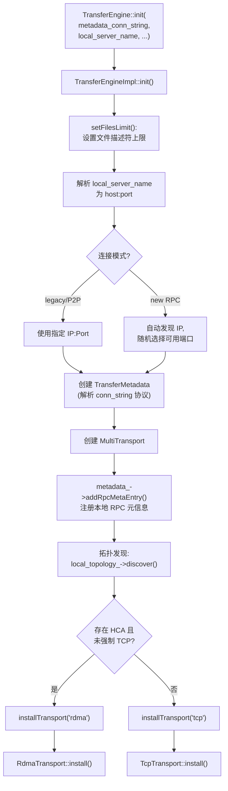

**源码关键行** (`transfer_engine_impl.cpp`):

- 行 84-88: `setFilesLimit()` 设置 fd 上限
- 行 114: `parseHostNameWithPort()` 解析 `local_server_name`
- 行 120-180: RPC 绑定方式选择（legacy/P2P vs 随机端口）
- 行 192: `TransferMetadata` 创建，解析连接字符串协议
- 行 199: `MultiTransport` 创建
- 行 202: `addRpcMetaEntry()` 注册本地 RPC 元信息到元数据存储
- 行 236-251: 拓扑发现（自动或加载自定义 JSON）
- 行 305-330: 安装 RDMA Transport（当有 HCA 时）

### 2.2 RdmaTransport 安装

**调用链**: `MultiTransport::installTransport("rdma")` → `RdmaTransport::install()`

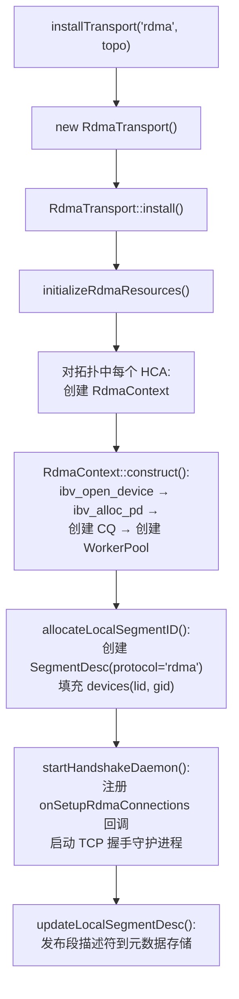

**源码关键行** (`rdma_transport.cpp`):

- 行 60-80: 构造函数检查 `ibv_reg_mr_iova2` 符号，判断是否支持 IBV Relaxed Ordering
- 行 92-130: `install()` 四步初始化
- 行 651-672: `initializeRdmaResources()` — 遍历 HCA 列表创建 Context，失败的设备被 `disableDevice()` 排除
- 行 360-381: `allocateLocalSegmentID()` — 构建 SegmentDesc，包含所有设备的 lid/gid
- 行 674-679: `startHandshakeDaemon()` — 将 `onSetupRdmaConnections` 绑定为握手回调

### 2.3 RdmaContext 构造

**调用链**: `RdmaContext::construct()`

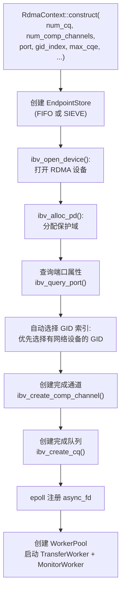

**GID 索引自动选择逻辑**:
1. 遍历所有 GID 索引（0 到 gid_tbl_len-1）
2. 对每个 GID，检查其关联的网络设备（通过 sysfs 路径 `/sys/class/infiniband/<dev>/device/net/`）
3. 优先选择有网络设备的 GID（`GID_WITH_NETWORK`）
4. 如果用户指定了 `MC_GID_INDEX`，则使用指定值

---

## 3. 阶段二：内存注册与段描述符发布

### 3.1 内存注册

**调用链**: `TransferEngine::registerLocalMemory()` → `TransferEngineImpl::registerLocalMemory()` → `RdmaTransport::registerLocalMemoryInternal()`

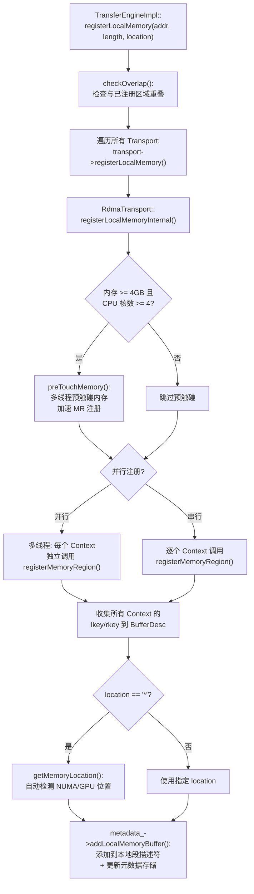

**源码关键行** (`rdma_transport.cpp` 行 182-303):

- 行 189-196: 访问权限 = `LOCAL_WRITE | REMOTE_WRITE | REMOTE_READ` + 可选 `RELAXED_ORDERING`
- 行 197-199: 预触碰条件: 内存 ≥ 4GB 且 CPU ≥ 4 核
- 行 217-223: 并行注册决策: `MC_ENABLE_PARALLEL_REG_MR` 或自动（多 Context + 预触碰完成时）
- 行 278-281: 收集每个 Context 的 lkey/rkey
- 行 285-293: 自动检测内存位置（通配符 `*` 时）

### 3.2 RdmaContext::registerMemoryRegion() 内部流程

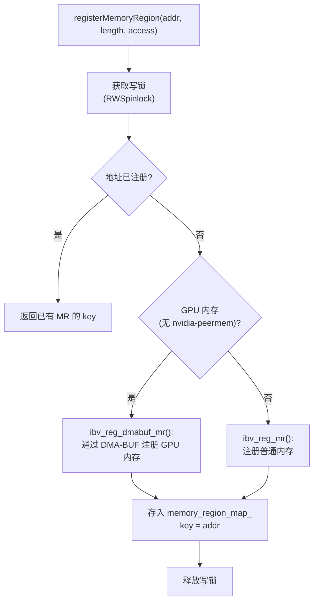

### 3.3 段描述符发布与同步

内存注册完成后，`addLocalMemoryBuffer()` 会更新本地 SegmentDesc（添加 BufferDesc），并通过 `update_metadata=true` 参数将最新描述符写入元数据存储。

**远端节点查询段描述符**（`openSegment` 时触发）:
1. `openSegment(peer_name)` → `metadata_->getSegmentID(peer_name)`
2. `getSegmentID()` → `getSegmentDescByName()` — 先查本地缓存，未命中则从元数据存储获取
3. 获取的 SegmentDesc 包含远端的 devices（lid, gid）、buffers（addr, length, rkey 列表）、topology

---

## 4. 阶段三：连接建立（控制路径核心）

连接建立是按需（on-demand）的：首次向某个远端 NIC 发送数据时才建立 QP 连接。

### 4.1 完整连接建立流程

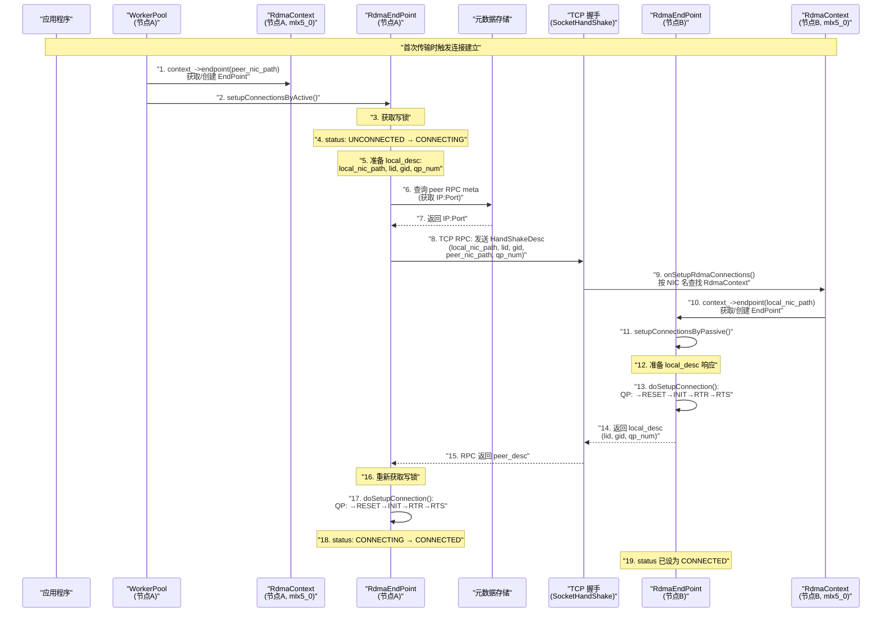

### 4.2 QP 状态转换详解

`doSetupConnection()` (行 710-838) 对每个 QP 执行四步状态转换：

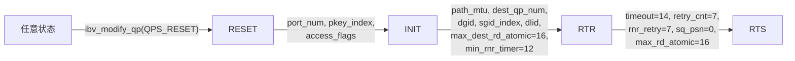

**各步骤详细参数**:

| 转换 | 关键参数 | 说明 |
|------|----------|------|
| →RESET | `IBV_QP_STATE` | 清除 QP 状态 |
| →INIT | `port_num`, `pkey_index=0`, `access_flags=LOCAL_WRITE\|REMOTE_READ\|REMOTE_WRITE\|REMOTE_ATOMIC` | 初始化端口和权限 |
| →RTR | `path_mtu`(受 `MC_MTU` 上限约束), `dest_qp_num`, `dgid`(对端 GID), `sgid_index`, `dlid`(对端 LID), `hop_limit=16`, `is_global=1`, `max_dest_rd_atomic=16`, `min_rnr_timer=12` | 配置接收路径 |
| →RTS | `timeout=14`, `retry_cnt=7`, `rnr_retry=7`, `sq_psn=0`, `max_rd_atomic=16` | 配置发送路径 |

**流量类别** (行 792-795): 如果 `MC_IB_TC >= 0`，设置 `ah_attr.grh.traffic_class`，用于 RoCEv2 的 DSCP/QoS 标记。

### 4.3 并发握手保护

当多个线程同时触发同一 Endpoint 的连接建立时：

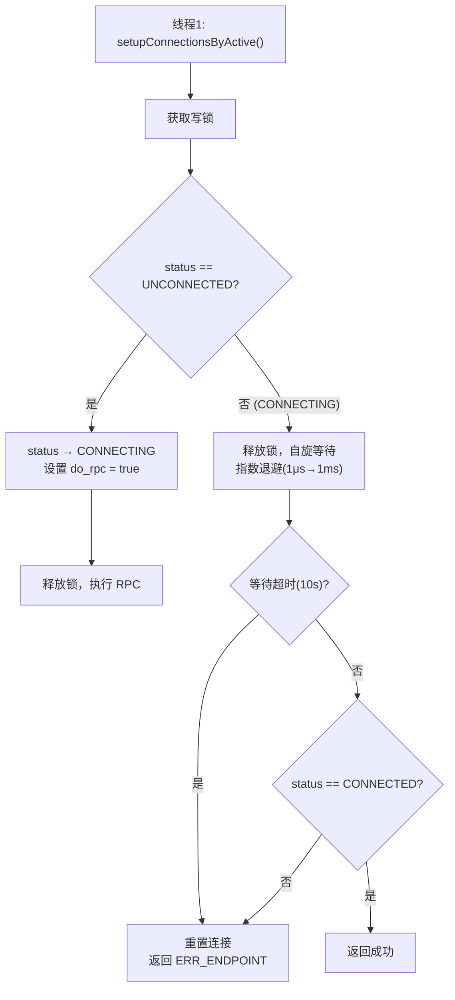

**同时打开 (Simultaneous Open)**: 如果 A→B 和 B→A 的握手同时发生，被动方（先收到 RPC 的一方）会先完成 `setupConnectionsByPassive()`，将 Endpoint 设为 CONNECTED。主动方 RPC 返回后，发现已经 CONNECTED，且 QP 号一致时复用现有连接。

---

## 5. 阶段四：数据传输（数据路径核心）

### 5.1 完整数据路径总览

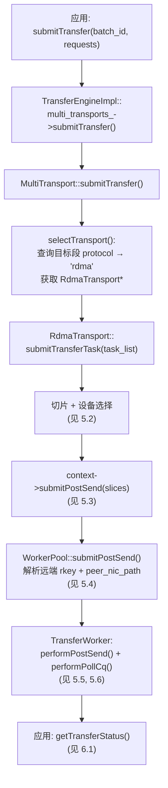

### 5.2 切片与设备选择

**源码**: `rdma_transport.cpp` 行 456-573 `submitTransferTask()`

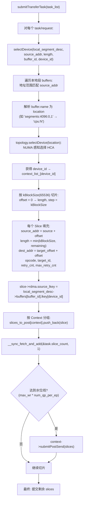

**selectDevice 详解** (行 684-727):

1. 遍历 SegmentDesc 的 buffers 数组
2. 对每个 buffer，检查 `offset` 是否在 `[buffer.addr, buffer.addr + buffer.length)` 范围内
3. 解析 buffer.name：
   - 普通格式 `"cpu:0"` → 直接使用
   - 分段格式 `"segments:4096:0,1"` → 调用 `resolveSegmentsLocation()` 根据偏移计算实际 NUMA 节点
4. 调用 `topology.selectDevice(location, retry_count)`:
   - `retry_count=0`: 从 preferred_hca 随机选择（或 `MC_PATH_ROUNDROBIN` 轮询）
   - `retry_count>0`: 确定性循环遍历 preferred+available（用于故障重试）
5. 回退: 若指定 location 无设备，尝试通配符 `"*"` location

**碎片合并优化** (行 491-492): 当剩余数据 ≤ `kBlockSize + kFragmentSize` 时，合并为一个 Slice，避免产生极小的尾 Slice。

### 5.3 Context 级提交

**源码**: `rdma_transport.cpp` 行 571-572

```cpp
for (auto &entry : slices_to_post)
    if (!entry.second.empty()) entry.first->submitPostSend(entry.second);
```

直接调用 `RdmaContext::submitPostSend()`，委托给 `WorkerPool::submitPostSend()`。

### 5.4 WorkerPool 提交 — 解析远端信息

**源码**: `worker_pool.cpp` 行 60-171

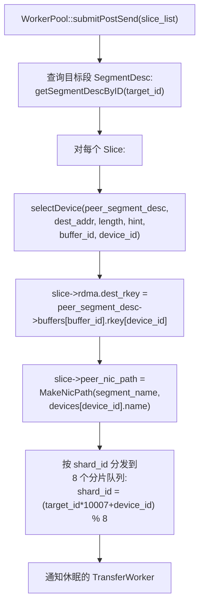

**关键数据转换**:

| Slice 字段 | 来源 | 说明 |
|------------|------|------|
| `source_addr` | `request.source + offset` | 本地源地址 |
| `rdma.source_lkey` | `local_segment_desc->buffers[buf_id].lkey[dev_id]` | 本地 MR 的 lkey |
| `rdma.dest_addr` | `request.target_offset + offset` | 远端目标地址 |
| `rdma.dest_rkey` | `peer_segment_desc->buffers[buf_id].rkey[dev_id]` | 远端 MR 的 rkey |
| `peer_nic_path` | `MakeNicPath(peer_name, peer_dev_name)` | 对端 NIC 标识 |
| `rdma.retry_cnt` | `request.advise_retry_cnt` | 当前重试计数 |
| `rdma.max_retry_cnt` | `globalConfig().retry_cnt` (默认9) | 最大重试次数 |

### 5.5 TransferWorker — Post Send

**源码**: `worker_pool.cpp` 行 173-267 `performPostSend()`

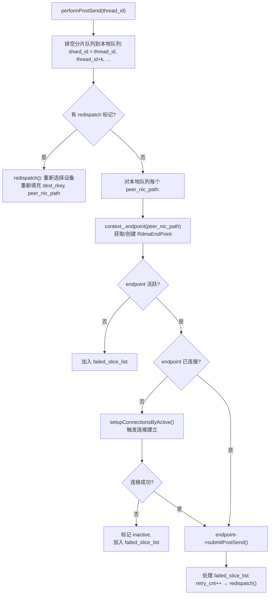

### 5.6 RdmaEndPoint — 构建 ibv_send_wr 并提交

**源码**: `rdma_endpoint.cpp` 行 578-661 `submitPostSend()`

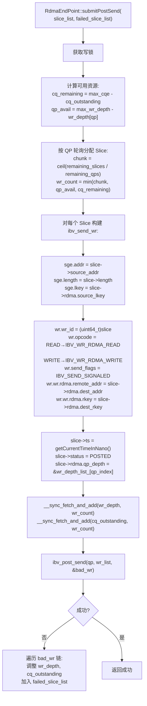

**ibv_send_wr 关键映射**:

```
Slice 字段            →  ibv_send_wr / ibv_sge 字段
─────────────────────────────────────────────────
source_addr           →  sge.addr
length                →  sge.length
rdma.source_lkey      →  sge.lkey
opcode (READ/WRITE)   →  wr.opcode (IBV_WR_RDMA_READ/IBV_WR_RDMA_WRITE)
rdma.dest_addr        →  wr.wr.rdma.remote_addr
rdma.dest_rkey        →  wr.wr.rdma.rkey
(slice 指针)          →  wr.wr_id (完成时用于回查)
```

### 5.7 TransferWorker — Poll CQ 完成处理

**源码**: `worker_pool.cpp` 行 269-350 `performPollCq()`

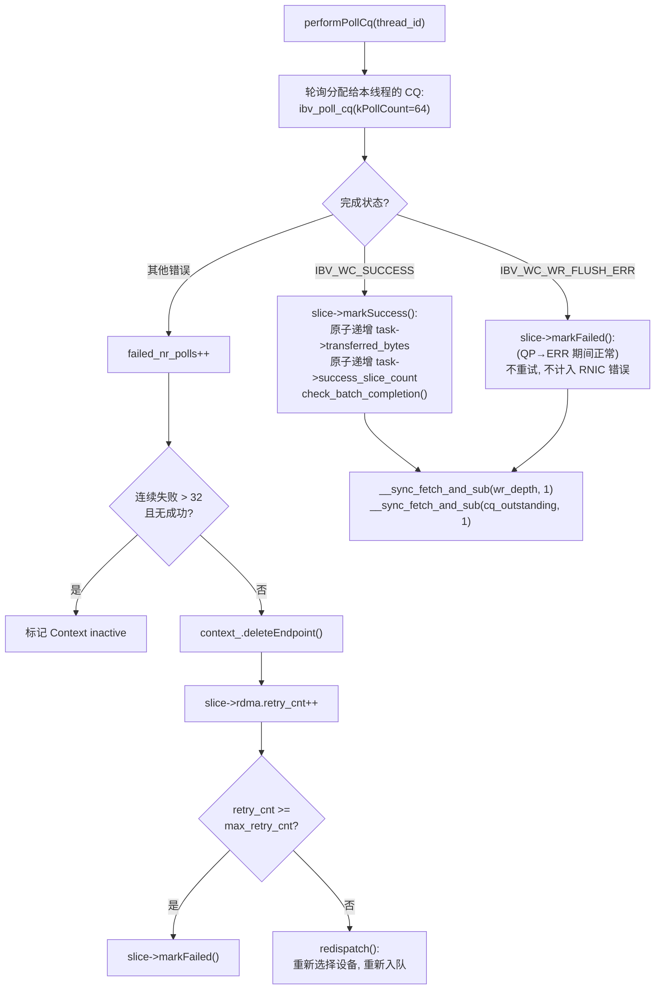

### 5.8 markSuccess/markFailed — 原子状态更新

**源码**: `transport.h` Slice 内联方法

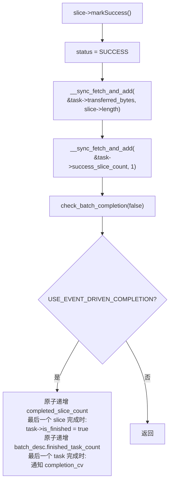

### 5.9 数据路径完整时序图

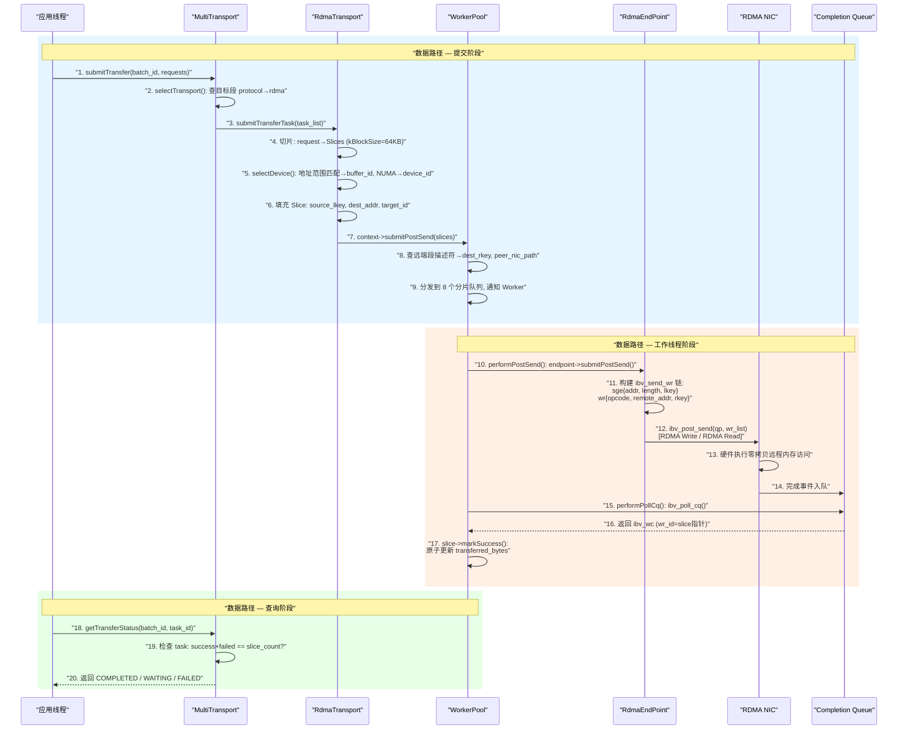

---

## 6. 阶段五：状态查询与通知

### 6.1 状态查询

**调用链**: `TransferEngine::getTransferStatus()` → `TransferEngineImpl::getTransferStatus()` → `MultiTransport::getTransferStatus()`

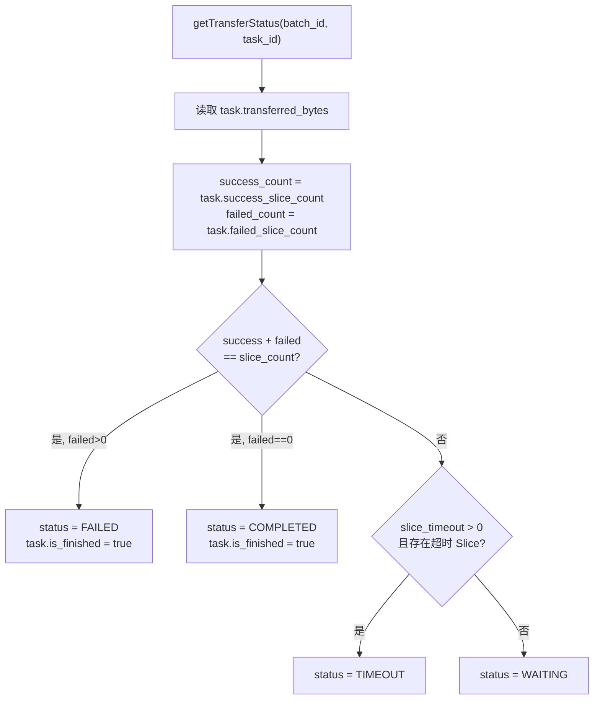

**超时检测** (行 210-223): 遍历 task 的所有 Slice，检查 `slice->ts`（提交时间戳）与当前时间的差值是否超过 `MC_SLICE_TIMEOUT` 秒。

### 6.2 通知机制

**调用链**: `submitTransferWithNotify()` → 传输完成后自动发送通知

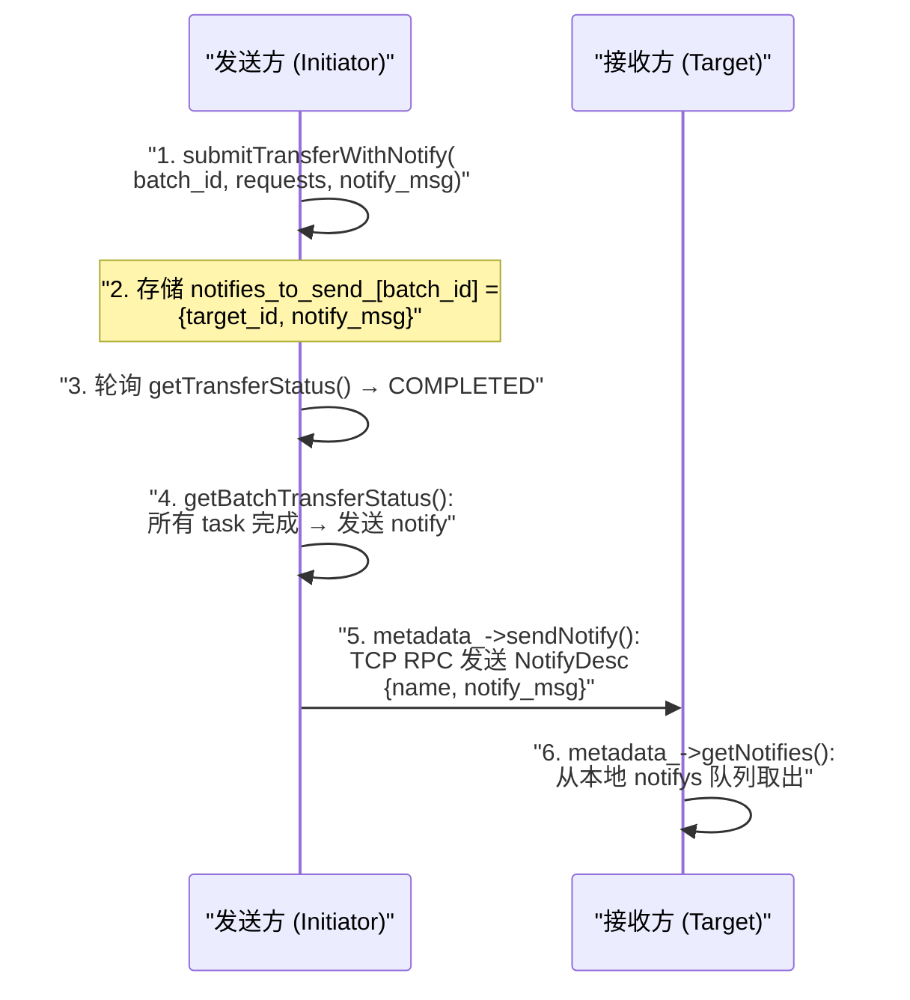

**源码** (`transfer_engine_impl.h` 行 133-159): `submitTransferWithNotify()` 在调用 `multi_transports_->submitTransfer()` 后，将 `{target_id, notify_msg}` 存入 `notifies_to_send_` 映射。当 `getTransferStatus()` 检测到 COMPLETED 时，调用 `sendNotifyByID()` 通过 TCP RPC 发送通知。

---

## 7. 阶段六：错误处理与重试

### 7.1 错误处理层级

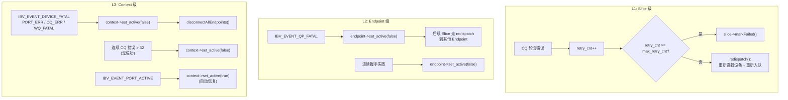

### 7.2 Redispatch 流程

**源码**: `worker_pool.cpp` 行 352-389

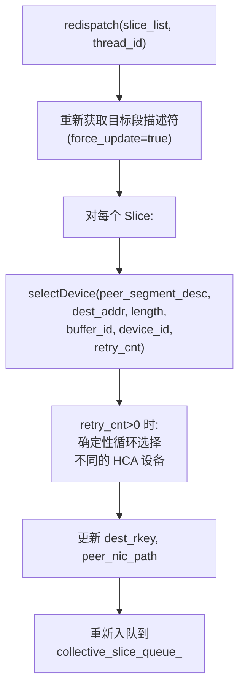

**关键**: `selectDevice()` 在 `retry_cnt > 0` 时采用确定性循环策略，确保重试时选择不同的 HCA，实现故障路径切换。

### 7.3 两阶段 Endpoint 销毁

```mermaid
flowchart TD
    A["Endpoint 被标记删除"] --> B["beginDestroy():<br/>active_=false, status_=DESTROYING<br/>QP → ERR 状态<br/>(硬件刷出 inflight WR)"]
    B --> C["performPollCq():<br/>收到 WR_FLUSH_ERR 完成<br/>slice->markFailed()"]
    C --> D["MonitorWorker 周期调用:<br/>context_->reclaimEndpoints()"]
    D --> E["finishDestroy():<br/>等待 wr_depth == 0<br/>(30s 超时)"]
    E --> F["deconstructLocked():<br/>ibv_destroy_qp()<br/>释放资源"]
    F --> G["status_ = DESTROYED"]
```

**死锁避免** (行 423-494): 在 `doProcessContextEvents()` 中，先 `ibv_ack_async_event()` 再调用 `set_active(false)` 或 `disconnectAllEndpoints()`。因为 `ibv_destroy_qp` 可能阻塞等待 event ack，而 `disconnect()` 需要获取 endpoint 锁，如果顺序反了会死锁。

---

## 8. 阶段七：资源销毁

### 8.1 Engine 释放

```mermaid
flowchart TD
    A["TransferEngineImpl::freeEngine()"] --> B["metadata_->removeRpcMetaEntry():<br/>从元数据存储移除 RPC 信息"]
    B --> C["metadata_.reset():<br/>销毁 TransferMetadata<br/>(关闭握手守护线程)"]
    C --> D["multi_transports_.reset():<br/>销毁 MultiTransport"]
    D --> E["销毁 TransportMap 中所有 Transport"]
    E --> F["RdmaTransport::~RdmaTransport():<br/>removeSegmentDesc()<br/>清空 context_list_"]
    F --> G["~RdmaContext():<br/>WorkerPool 停止<br/>销毁 QP, CQ, PD<br/>ibv_close_device()"]
```

### 8.2 内存注销

```mermaid
flowchart TD
    A["unregisterLocalMemory(addr)"] --> B["遍历所有 Transport:<br/>transport->unregisterLocalMemory()"]
    B --> C["RdmaTransport::<br/>unregisterLocalMemoryInternal()"]
    C --> D["metadata_->removeLocalMemoryBuffer():<br/>从段描述符移除 BufferDesc<br/>更新元数据存储"]
    D --> E["遍历所有 Context:<br/>unregisterMemoryRegion(addr)"]
    E --> F["ibv_dereg_mr(mr)"]
```

---

## 9. MonitorWorker — 后台守护

**源码**: `worker_pool.cpp` 行 497-527

MonitorWorker 以 1 秒为周期运行，执行两项任务：

```mermaid
flowchart TD
    A["monitorWorker()"] --> B["周期性任务 (1s):"]
    B --> C["context_.set_active(true):<br/>尝试重新激活 Context<br/>(恢复被临时标记 inactive 的设备)"]
    B --> D["context_.reclaimEndpoints():<br/>回收 waiting_list_ 中的 Endpoint:<br/>beginDestroy() → finishDestroy()"]
    B --> E["epoll_wait(async_fd, 100ms timeout)"]
    E --> F{"有异步事件?"}
    F -->|"是"| G["doProcessContextEvents()"]
    F -->|"否"| H["继续循环"]
    G --> I{"事件类型?"}
    I -->|"QP_FATAL"| J["endpoint->set_active(false)"]
    I -->|"DEVICE_FATAL /<br/>CQ_ERR / WQ_FATAL /<br/>PORT_ERR / LID_CHANGE"| K["context->set_active(false)<br/>disconnectAllEndpoints()"]
    I -->|"PORT_ACTIVE"| L["context->set_active(true)"]
```

---

## 10. 控制路径与数据路径交互总览

```mermaid
flowchart TD
    subgraph "控制路径 (Control Plane)"
        INIT["初始化: init()"]
        TOPO["拓扑发现: discover()"]
        INSTALL["Transport 安装: install()"]
        REG["内存注册: registerLocalMemory()"]
        META_PUB["段描述符发布: updateLocalSegmentDesc()"]
        META_QUERY["段描述符查询: getSegmentDescByName()"]
        CONN["连接建立: setupConnectionsByActive/Passive()"]
        NOTIFY["通知: sendNotify/getNotifies()"]
        PROBE["探活: probePeerAliveByID()"]
        DESTROY["资源销毁: freeEngine()"]
    end

    subgraph "数据路径 (Data Plane)"
        SUBMIT["提交传输: submitTransfer()"]
        SLICE["切片: kBlockSize=64KB"]
        DEV_SEL["设备选择: selectDevice()"]
        POST["提交 WR: ibv_post_send()"]
        POLL["轮询完成: ibv_poll_cq()"]
        STATUS["状态更新: markSuccess/markFailed()"]
        QUERY["状态查询: getTransferStatus()"]
    end

    INIT --> TOPO --> INSTALL
    INSTALL --> REG --> META_PUB
    META_QUERY --> CONN
    CONN --> SUBMIT

    SUBMIT --> SLICE --> DEV_SEL --> POST --> POLL --> STATUS
    QUERY -.->|"读取 task 状态"| STATUS

    META_QUERY -.->|"为 POST 提供<br/>dest_rkey, peer_nic_path"| POST
    CONN -.->|"为 POST 提供<br/>QP 连接"| POST
    REG -.->|"为 POST 提供<br/>source_lkey"| POST
    META_PUB -.->|"远端查询<br/>段描述符"| META_QUERY

    STATUS -.->|"COMPLETED 触发"| NOTIFY
    POLL -.->|"错误触发<br/>redispatch"| DEV_SEL
```

---

## 11. 关键数据结构在路径中的流转

### 11.1 SegmentDesc 在各阶段的内容

```
初始化后 (allocateLocalSegmentID):
  name = "local_server_name"
  protocol = "rdma"
  devices = [{name: "mlx5_0", lid: 0x1234, gid: "fe80:..."}, ...]
  topology = {cpu:0 → preferred:[mlx5_0], ...}
  buffers = []  // 空，等待内存注册

内存注册后 (addLocalMemoryBuffer):
  buffers = [{addr: 0x7f000000, length: 1073741824,
              name: "cpu:0", lkey: [12345, 12346], rkey: [54321, 54322]}]
              // lkey/rkey 数组长度 = context_list_.size()

远端查询到:
  // 包含远端的 devices, buffers(含rkey), topology
  // 本地 WorkerPool 通过 rkey[device_id] 获取远端访问密钥
```

### 11.2 Slice 字段在各阶段的填充

| 阶段 | 填充的字段 |
|------|-----------|
| `submitTransferTask()` | `source_addr`, `length`, `opcode`, `target_id`, `rdma.dest_addr`, `rdma.retry_cnt`, `rdma.max_retry_cnt`, `task`, `status=PENDING` |
| `submitTransferTask()` | `rdma.source_lkey` (从本地段描述符的 `buffers[buffer_id].lkey[device_id]`) |
| `WorkerPool::submitPostSend()` | `rdma.dest_rkey` (从远端段描述符的 `buffers[buffer_id].rkey[device_id]`), `peer_nic_path` |
| `RdmaEndPoint::submitPostSend()` | `rdma.qp_depth` (指向 `wr_depth_list_[qp_index]`), `ts`, `status=POSTED` |
| `performPollCq()` | 通过 `markSuccess/markFailed` 更新 `task` 的原子计数器 |

---

## 12. 环境变量对数据路径的影响

| 环境变量 | 影响的数据路径阶段 | 效果 |
|----------|-------------------|------|
| `MC_SLICE_SIZE` | 切片 | 每个 Slice 的大小（默认 65536） |
| `MC_RETRY_CNT` | 错误重试 | 最大重试次数（默认 9） |
| `MC_MAX_WR` | WR 提交 | 每个 QP 的最大 WR 深度（默认 256） |
| `MC_NUM_QP_PER_EP` | 连接建立 | 每 Endpoint 的 QP 数量（默认 2） |
| `MC_WORKERS_PER_CTX` | 工作线程 | 每 Context 的 TransferWorker 数量（默认 2） |
| `MC_MAX_CQE_PER_CTX` | CQ 轮询 | CQ 容量，影响一次可提交的 WR 数量 |
| `MC_IB_TC` | QP 建立 | RoCEv2 流量类别/DSCP 标记 |
| `MC_ENDPOINT_STORE_TYPE` | Endpoint 管理 | FIFO 或 SIEVE（默认 SIEVE）淘汰策略 |
| `MC_SLICE_TIMEOUT` | 状态查询 | Slice 超时检测（秒） |
| `MC_ENABLE_DEST_DEVICE_AFFINITY` | 设备选择 | 启用目的端设备亲和性选择 |
| `MC_PATH_ROUNDROBIN` | 设备选择 | 首次选择使用轮询而非随机 |
| `MC_FORCE_TCP` | 初始化 | 强制使用 TCP 而非 RDMA |